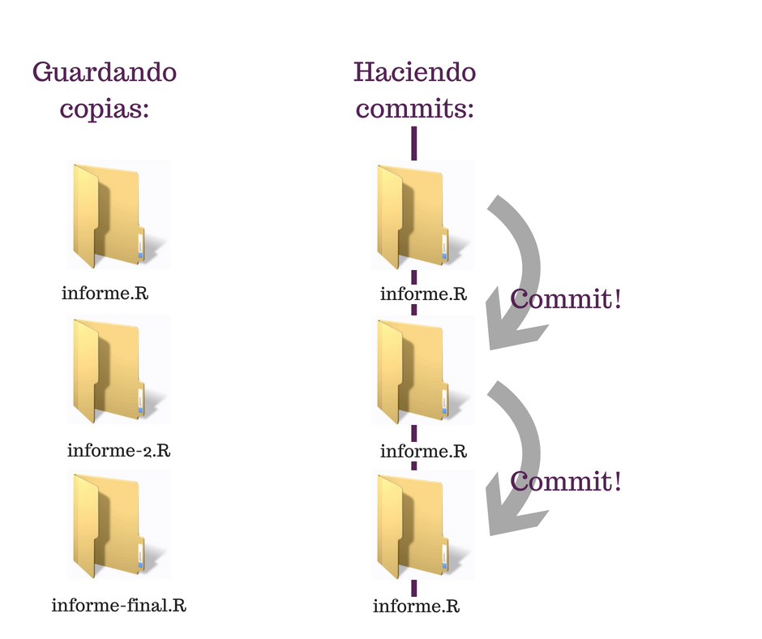
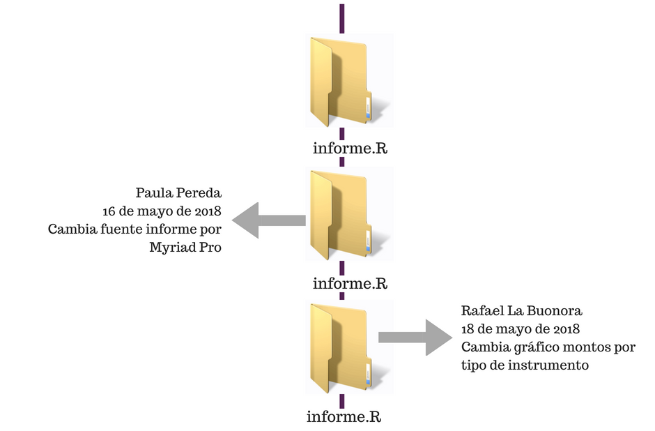
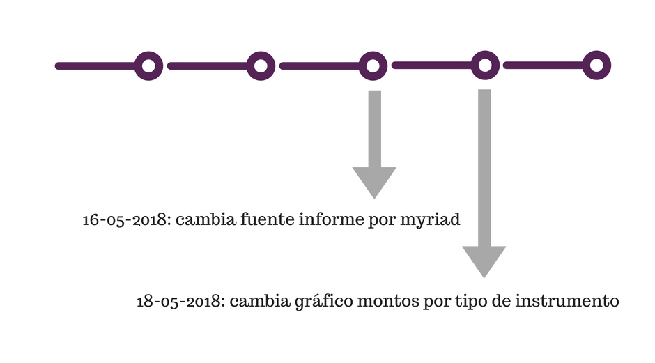
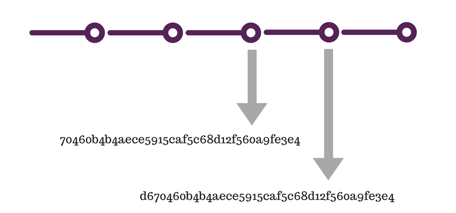
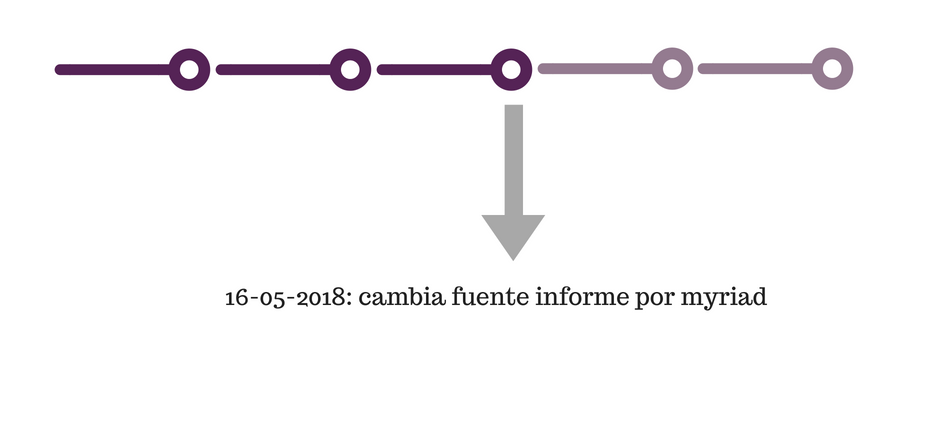
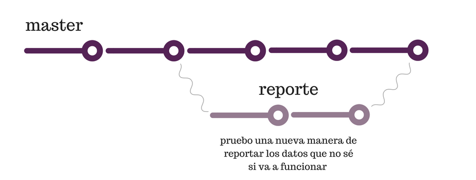
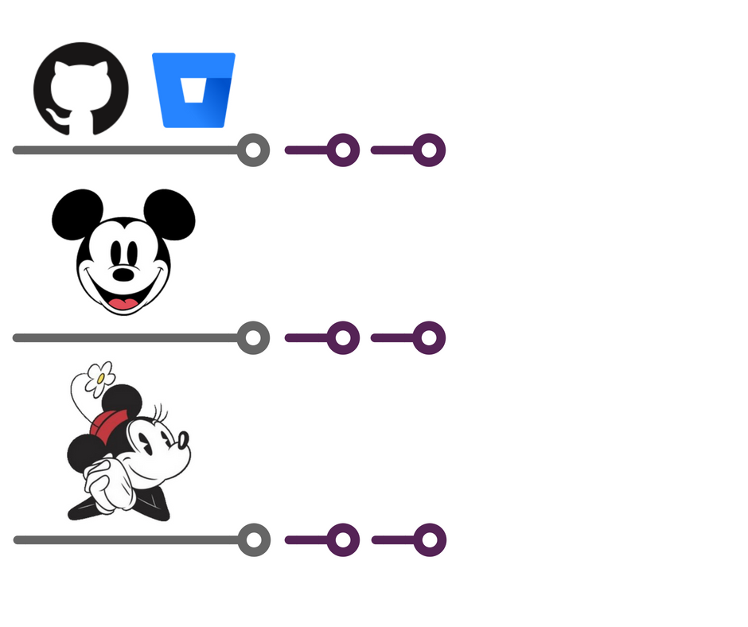
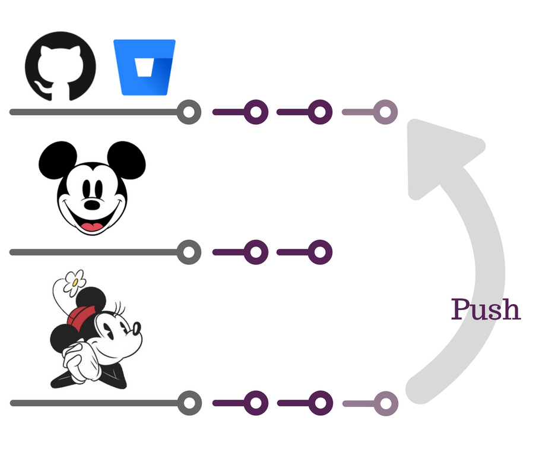
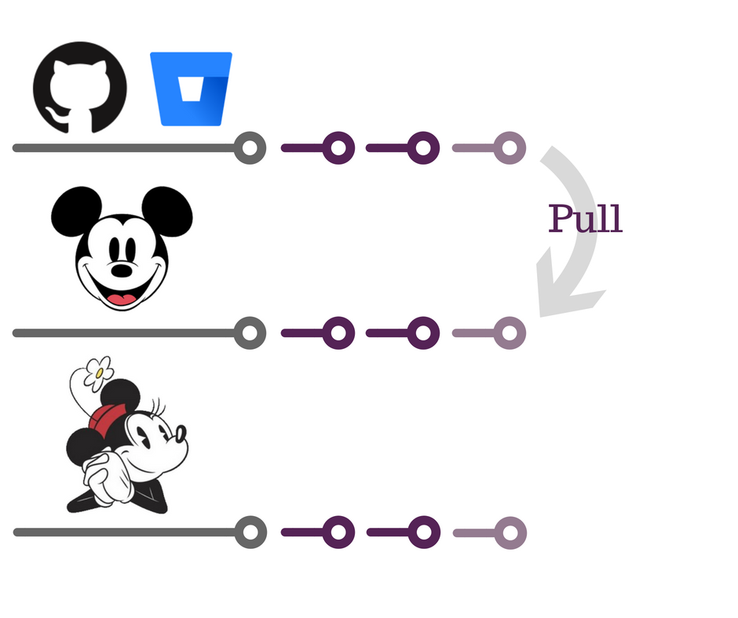

# **¿Qué es git?**

- un software de control de versiones

## **Control de versiones es un sistema que:**

- mantiene un registro de todos sus cambios 

- permite un entorno para el desarrollo colaborativo

- permite saber quién hizo qué cambios y cuándo

- nos permite revertir cualquier cambio y volver a un estado previamente guardado

---


# **¡A considerar!**


- Es importante pensar en términos de “cambios” a los archivos
- También es importante ser disciplinado
- Cuando las cosas se complican es cuando $git$ más sirve, pero es más probable que perdamos la disciplina (proyectos grandes, problemas difíciles)

# **Ventajas**

- Es un undo infinito (si lo usamos bien)
- Permite que todos trabajemos sobre el mismo conjunto de archivos
- Permite tener varias copias del código (puedo experimentar y aprender sobre el problema que estoy tratando de resolver, tirar todo, y después crear una solución)

---
# **Nos introducimos a Git**

```{r, eval=FALSE}
$ git config --global user.name 'Paula Pereda'
$ git config --global user.email 'ppereda@transformauruguy.gub.uy'
$ git config --global --list
```
---
#**1) Git nos deja grabar la historia de nuestros proyectos**

- usamos $Git$ para sacar instantáneas de todos los archivos que hay una carpeta, esta carpeta se llama $repositorio$ 
- cuando quiero sacar una instantánea de un archivo o archivos, hago un $commit$ 

.center[
]
---

# **commit**

Cuando hago un $commit$ a uno o más archivos, se guarda cierta información junto a los cambios de los archivos:

    1) cuándo fue
    
    2) quién fue
    
    3) mensaje (por qué hice el cambio)
    
.pull-left[
]

.pull-right[
]

---

# **2) Git nos deja viajar en el tiempo**

- una vez que guardamos las instantáneas, $Git$ nos deja movernos a través de ellas 

- cada $commit$ tiene un identificador único llamado $hash$

- puedo volver en el tiempo utilizando el $hash$ (conocido como $checkout$): mis otros $commits$ siguen existiendo pero puede trabajar en él como si los demás no hubiesen existido

.pull-left[
]

.pull-right[
]


---
# **3) Git nos deja experimentar tranquilamente**

Hasta ahora hemos trabajado de forma lineal, la $branch$ por defecto es $master$ pero se pueden crear nuevas $branches$ durante el desarrollo

    1) si me gustan: la fusiono con master
     
    2) si no me gustan: puedo descartalas rápidamente 

.center[
]
---
# **4) Git nos respalda el trabajo**

- Lo ideal es siempre respaldar el trabajo y tenerlo en un lugar geográficamente distinto a mi PC

- En $Git$ esto es conocido como $remote$ como Github y Bitbucket

.center[
]
---
# **push**

.center[
]

---
# **pull**

.center[
]
---

# **Conceptos básicos**

- $Working$ $directory:$ es el estado actual de los archivos en el disco duro

- $Staging$ $area:$ limbo (zona intermedia) donde pongo todos los cambios antes de commitearlos

- $Commit:$ un conjunto de cambios (sustantivo)

- $Commit:$ guardar un conjunto de cambios en la historia del repo (verbo)

.center[
]

📍 Los comandos tienen opciones que modifican (sustancialmente) lo que hacen.

---
# **Manos en obra**
Tengo un archivo:

```{r, eval=FALSE}
main.R
```
## **1) Iniciar un nuevo repositorio**
```{r, eval=FALSE}
$ git init # crea el repo
```
---
## **2) Agregar cambios al staging area**
```{r, eval=FALSE}
$ git add main.R # agrega (los cambios en) main al "staging area"
```

## **3) Commitear todo lo stageado**

```{r, eval=FALSE}
$ git commit -m "Commit inicial" # commiteo todo los cambios del staging area
```
---

# **Flujo de Trabajo**

Hacemos algunos cambios:

```{r, eval=FALSE} 

# Un script para calcular exportaciones por sector:

library(tibble)

sectores <- tibble(ciiu = c("0111", "0110", "0112"),
                   giro = c("arroz", "soja", "carne"))

expors <- tibble(empresa = c("ZZZ", "YYY", "XXX", "WWW", "NNN"),
                 expors = c(10000, 9000,    8000, 3000, 1000 ))
```

Para ver las diferencias entre working y el último $commit$:

```{r, eval=FALSE} 
$ git diff
```
---

#**Me gustan los cambios**

$git$ $status$ me da un resumen de estos cambios, para agregarlos al $staging$ $area$:

```{r, eval=FALSE} 
$ git add main.R
```
Ahora $git$ $status$ cambia: ¡️tengo cambios stageados listos para ser commiteados!

Para commitear:

```{r, eval=FALSE} 
$ git commit -m "Agrega data frames"
```

📍 Ahora $git$ $status$ dice que no hay cambios.

---

#**Ejercicio: otro cambio**

    1) Agrego la empresa “RRR” que exporta 5000

    2) Escenarios:

      - Hago el cambio y lo deshago
  
      - Hago el cambio, lo stageo y lo deshago
  
      - Hago el cambio, lo comiteo y lo deshago
---

# **Primer escenario**

Lo quiero deshacer sin haber hecho nada más que cambiar el working directory.

Interpretar:

```{r, eval=FALSE} 
$ git status
```

Interpretar:

```{r, eval=FALSE} 
$ git diff
```


Deshacer cambio:

```{r, eval=FALSE} 
$ git checkout main.R
```

Saca la última versión comitteada de un archivo.

📍 Ahora: $git$ $status$ y $git$ $diff$ están “limpios”

---

# **Segundo escenario**

Hago el cambio y lo stageo:

```{r, eval=FALSE} 
$ git add main.R
```

¿Y ahora? $git$ $diff$ ya no da nada ¡Tengo cambios para ser commiteados!

```{r, eval=FALSE} 
$ git reset HEAD main.R # destagear cambios
$ git checkout main.R  # ahora estoy igual que en el anterior
```
---

# **Tercer escenario**

Hago el cambio, lo stageo y lo commiteo.

¿Memoria?

---

#**Deshacer cambios commiteados con revert**

Sirve para dejar los logs de haber deshecho el commit:

```{r, eval=FALSE} 
$ git revert HEAD
```

#**Deshacer cambios commiteados con reset**

```{r, eval=FALSE} 
$ git reset --hard HEAD^1
```
---

#**Repositorios remotos con Github**

Descargamos las diapos desde $Github$:

$ git clone https://github.com/rlabuonora/taller_R.git

Hago un cambio y lo subo.

Hago el cambio:

```{r, eval=FALSE} 
$ git add README.md
$ git commit -m "Cambio en README"
```

Y lo mando (me pide credenciales $Github$ y tengo que tener permiso del admin del repo):

```{r, eval=FALSE}
$ git push origin master
```


