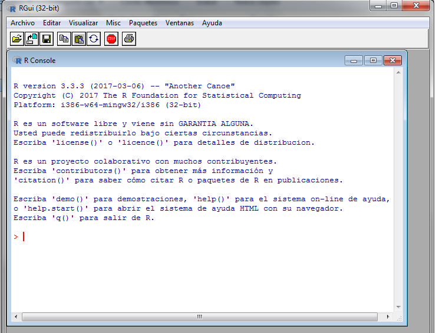

```{r setup, include=FALSE, echo=FALSE, error=FALSE, message=FALSE, warning=FALSE }
knitr::opts_chunk$set(fig.width=20, fig.height=8)
``` 

## ¿Qué es R?

* Paquete estadístico (SPSS, STATA, Excel(?))
* Open Source
* Ecosistema de herramientas (RStudio, dplyr)

## Introducción

* Código: 

[Taller R en Github](https://github.com/rlabuonora/taller_R)

* Para clonarlo desde GIT: 

```{r, eval=FALSE}
$ git clone https://github.com/rlabuonora/taller_R.git
```
## Interfaz (1)

* Escribo comandos para evaluarlos directamente

<div align="center">

</div>


## Interfaz (2)


* Archivos de texto salvados con código fuente

<div align="center">

</div>


## Consola

* Es la forma más básica de interactuar con R

```{r}
6*8
2^6
```  
  
* Arriba y abajo para scrollear los comandos

## Funciones predefinidas


```{r}
sqrt(2)

```
* Para ver la ayuda de la funcion sqrt:

```{r}
?sqrt
```

##Variables

* Sirven para almacenar resultados intermedios y organizar los programas:

```{r}
RaizDeDos <- sqrt(2)
HorasPorAnio = 365 * 60
```

* En Excel y Stata no existen (!)


## Ambiente (environment)

* Es el conjunto de objetos disponibles a través de variables
```{r}
ls()
```
## Funciones definidas por usuarios

* Es el conjunto de objetos disponibles a través de variables:

```{r}
MyAbs <- function(x) {
    if ( x < 0 ) -x
    else x
}
MyAbs(-1)
MyAbs(2)
```

## Importar archivo de datos

* Se pueden importar archivos de text, SPSS, Stata, etc.

```{r}
who <- read.csv("data/WHO.csv")

```
## Estructura

* Un data frame es una lista de vectores
```{r, results = 'markup'}
who <- str(who)
```
## Data frames

* Para acceder a uno usamos el operador __$__:
```{r}
who <- read.csv("data/WHO.csv")
head(who$Country) # 
```
* `head` es una función que me muestra los primeros valores de un vector
```{r}
head(who$Country) 
```
## Manejo de archivos

```{r}
who <- read.csv("data/WHO.csv")
# subset
who_euro <- subset(who, Region=="Europe")
# salvar como csv
write.csv(who_euro, file="data/euro.csv")
```
##Info sobre el data frame

```{r}
nrow(who)
nrow(who_euro)
ncol(who)
names(who)
```

## Estadísticas descriptivas

```{r}
summary(who)
```
## Vectores

* Son la base de los data frames (un data frame es una lista de vectores (?))
* Muchas funciones trabajan con vectores
* Para crear un vector de números uso la función *c*:

```{r}
vec <- c(2, 3, 5, 8, 13)
vec
```
- Accedo por el índice a cada componente
```{r}
vec[3]
```

## Vectores (2)

* Pueden ser de texto
```{r}
counts <- c("Brazil", "China", "India", "Switzerland", "USA")
life_exp<- c(74, 76, 65, 83, 79)
```
* Para crear un data frame a partir de vectores:
```{r}
country_data <- data.frame(counts, life_exp)
str(country_data)
```

##Vectores (3) -Operador $

* El operador *$* me permite acceder a un item de una lista
```{r}
country_data$pop <- c(199000, 1390000, 1240000, 7997, 318000)
str(country_data)
```
* ¡Cuidado con el orden!


##Preguntas más específicas sobre los datos

- País con menor proporción de menores de 15
```{r}
which.min(who$Under15)
who$Country[which.min(who$Under15)]
```

##Visualización

- ¿Cuál es la relación entre el PIB y la tasa de fertilidad?
```{r,  fig.width=4, fig.height=4}
plot(who$GNI, who$FertilityRate)
```

## Subset

Hay dos países que no siguen la relacion negativa:
```{r}
outliers <- subset(who, GNI > 80000 | (FertilityRate > 5 & GNI > 20000))
outliers[c("Country", "GNI", "FertilityRate")]
```

##Histogramas

```{r}
hist(who$CellularSubscribers)
```

##Boxplots

```{r}
boxplot(who$LifeExpectancy ~ who$Region)
boxplot(who$LifeExpectancy ~ who$Region, xlab="", ylab="Life Expectancy", main="Life Expectancy by Region")
```

##Tables

* Si le doy un vector categórico, calcula los totales
```{r}
table(who$Region)
```
##Tapply

* Le doy un vector continuo, un vector categórico y una función
* Aplica la función a cada grupo del vector categórico

```{r}
tapply(who$Over60, who$Region, mean)
tapply(who$LiteracyRate, who$Region, min, na.rm=TRUE)
```


##Importar funcionalidad

La función library permite importar "bibliotecas"

```{r}
## install.packages("readstata13")
library(readstata13)
writing <- readstata13::read.dta13("data/writing.dta")
head(writing)
```


##Los datos 

Oraciones completas antes y después del tratamientos

- preS 
- postS

```{r}
summary(writing[c("preS", "postS")])

```

##Gráficamente


```{r}
boxplot(writing$preS, writing$postS)
```


##Distribución

¿Es normal?

```{r}
dPre <- density(writing$preS)
plot(dPre)
```

##Distribución


¿Es normal?

```{r}
dPost <- density(writing$postS)
plot(dPost)
```


##Estadísticamente


* Prueba de hipótesis:

```{r}
t.test(writing$postS, writing$preS )
```

* Nos da un intervalo de confianza para la diferencia de medias.


##Modelos lineales

Archivos nativos R
```{r}
nations <- readRDS("data/nations.rds")
summary(nations)

```

##Explicamos la variación en esperanza de vida

Un modelo lineal:


```{r}
modelo_gdp <- lm(life ~ school, data=nations)
summary(modelo_gdp)
```

##Visualizamos la relación entre variables

Gráficamente:

```{r echo=FALSE, warning=FALSE}
library(GGally)
ggpairs(data=nations, 
         columns=3:6, 
         title="tips data", 
         colour = "sex") 
```


##Modelo

* Especificamos un modelo multivariado para la esperanza de vida:


$$life= \beta_0 + \beta_1 * school + \beta_2 * log(gdp) + \beta_3 * adfert + \beta_4 childmort$$


##Para estimarlo


```{r}
modelo <- lm(life ~ school + log(gdp) + adfert + chldmort, data=nations)
summary(modelo)
```

##Conclusiones


* Si controlamos por el ingreso, la educación no afecta la esperanza de vida
* La relación entre la esperanza de vida y el ingreso no es lineal, pero es positiva

##Deberes

1) La propuesta esta en la carpeta demo (demo_ej.r)

2) La solución es (demo_sol.r)

3) Requiere usar varias funciones:
  
  * str 
  * is.na 
  * sort 
  * names
  * length
  * table
  * tapply
  

