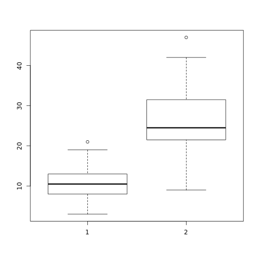
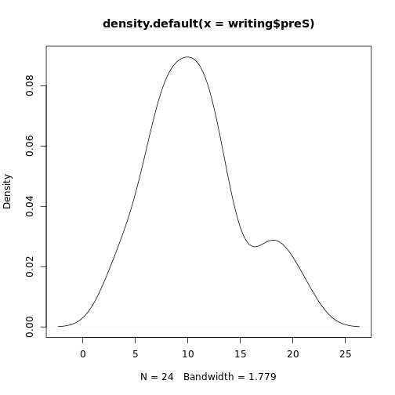
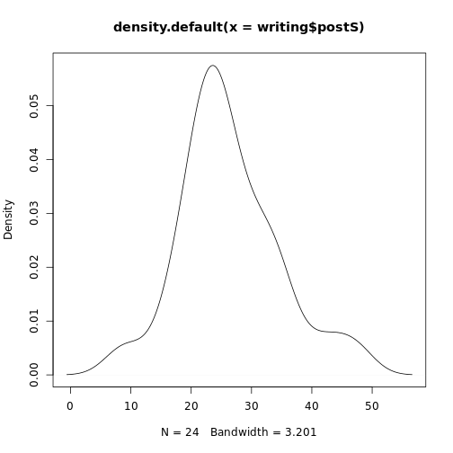
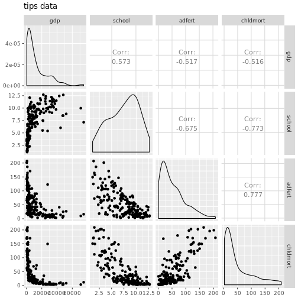

Taller 1 - Introducción a R
========================================================
author: 
date: 
autosize: true

¿Qué es R? 
========================================================

- Paquete estadístico (SPSS, STATA, Excel(?))
- Open Source
- Ecosistema de herramientas (RStudio, dplyr)


Introducción
========================================================

- Código: 

<https://github.com/rlabuonora/taller_R>

- Para clonarlo desde GIT: 

$ git clone https://github.com/rlabuonora/taller_R.git


Interfaz (1)
========================================================


- Escribo comandos para evaluarlos directamente


Interfaz (2)
========================================================


- Archivos de texto salvados con código fuente


Consola
========================================================
Es la forma más básica de interactuar con R


```r
6*8
```

```
[1] 48
```

```r
2^6
```

```
[1] 64
```
  
- Arriba y abajo para scrollear los comandos

Funciones predefinidas
========================================================


```r
sqrt(2)
```

```
[1] 1.414214
```
 - Para ver la ayuda de la funcion sqrt:

?sqrt

Variables
========================================================
Sirven para almacenar resultados intermedios y organizar los programas

```r
RaizDeDos <- sqrt(2)
HorasPorAnio = 365 * 60
```

En Excel y Stata no existen (!)


Ambiente (environment)
========================================================
Es el conjunto de objetos disponibles a través de variables

```r
ls()
```

```
[1] "HorasPorAnio" "RaizDeDos"   
```
Funciones definidas por usuarios
========================================================
Es el conjunto de objetos disponibles a través de variables

```r
MyAbs <- function(x) {
    if ( x < 0 ) -x
    else x
}
MyAbs(-1)
```

```
[1] 1
```

```r
MyAbs(2)
```

```
[1] 2
```

Importar archivo de datos
========================================================
Se pueden importar archivos de text, SPSS, Stata, etc.

```r
who <- read.csv("WHO.csv")
```
Estructura
========================================================
- Un data frame es una lista de vectores

```r
who <- str(who)
```

```
'data.frame':	194 obs. of  13 variables:
 $ Country                      : Factor w/ 194 levels "Afghanistan",..: 1 2 3 4 5 6 7 8 9 10 ...
 $ Region                       : Factor w/ 6 levels "Africa","Americas",..: 3 4 1 4 1 2 2 4 6 4 ...
 $ Population                   : int  29825 3162 38482 78 20821 89 41087 2969 23050 8464 ...
 $ Under15                      : num  47.4 21.3 27.4 15.2 47.6 ...
 $ Over60                       : num  3.82 14.93 7.17 22.86 3.84 ...
 $ FertilityRate                : num  5.4 1.75 2.83 NA 6.1 2.12 2.2 1.74 1.89 1.44 ...
 $ LifeExpectancy               : int  60 74 73 82 51 75 76 71 82 81 ...
 $ ChildMortality               : num  98.5 16.7 20 3.2 163.5 ...
 $ CellularSubscribers          : num  54.3 96.4 99 75.5 48.4 ...
 $ LiteracyRate                 : num  NA NA NA NA 70.1 99 97.8 99.6 NA NA ...
 $ GNI                          : num  1140 8820 8310 NA 5230 ...
 $ PrimarySchoolEnrollmentMale  : num  NA NA 98.2 78.4 93.1 91.1 NA NA 96.9 NA ...
 $ PrimarySchoolEnrollmentFemale: num  NA NA 96.4 79.4 78.2 84.5 NA NA 97.5 NA ...
```
Data frames
======================================================
- Para acceder a uno usamos el operador __$__

```r
who <- read.csv("WHO.csv")
head(who$Country) # head es una funcion que me muestra los primeros valores de un vector
```

```
[1] Afghanistan         Albania             Algeria            
[4] Andorra             Angola              Antigua and Barbuda
194 Levels: Afghanistan Albania Algeria Andorra ... Zimbabwe
```
Manejo de archivos
=========================================================

```r
who <- read.csv("WHO.csv")
# subset
who_euro <- subset(who, Region=="Europe")
# salvar como csv
write.csv(who_euro, file="euro.csv")
```
Info sobre el data frame
======================================================

```r
nrow(who)
```

```
[1] 194
```

```r
nrow(who_euro)
```

```
[1] 53
```

```r
ncol(who)
```

```
[1] 13
```

```r
names(who)
```

```
 [1] "Country"                       "Region"                       
 [3] "Population"                    "Under15"                      
 [5] "Over60"                        "FertilityRate"                
 [7] "LifeExpectancy"                "ChildMortality"               
 [9] "CellularSubscribers"           "LiteracyRate"                 
[11] "GNI"                           "PrimarySchoolEnrollmentMale"  
[13] "PrimarySchoolEnrollmentFemale"
```

Estadísticas descriptivas
======================================================

```r
summary(who)
```

```
                Country                      Region     Population     
 Afghanistan        :  1   Africa               :46   Min.   :      1  
 Albania            :  1   Americas             :35   1st Qu.:   1696  
 Algeria            :  1   Eastern Mediterranean:22   Median :   7790  
 Andorra            :  1   Europe               :53   Mean   :  36360  
 Angola             :  1   South-East Asia      :11   3rd Qu.:  24535  
 Antigua and Barbuda:  1   Western Pacific      :27   Max.   :1390000  
 (Other)            :188                                               
    Under15          Over60      FertilityRate   LifeExpectancy 
 Min.   :13.12   Min.   : 0.81   Min.   :1.260   Min.   :47.00  
 1st Qu.:18.72   1st Qu.: 5.20   1st Qu.:1.835   1st Qu.:64.00  
 Median :28.65   Median : 8.53   Median :2.400   Median :72.50  
 Mean   :28.73   Mean   :11.16   Mean   :2.941   Mean   :70.01  
 3rd Qu.:37.75   3rd Qu.:16.69   3rd Qu.:3.905   3rd Qu.:76.00  
 Max.   :49.99   Max.   :31.92   Max.   :7.580   Max.   :83.00  
                                 NA's   :11                     
 ChildMortality    CellularSubscribers  LiteracyRate        GNI       
 Min.   :  2.200   Min.   :  2.57      Min.   :31.10   Min.   :  340  
 1st Qu.:  8.425   1st Qu.: 63.57      1st Qu.:71.60   1st Qu.: 2335  
 Median : 18.600   Median : 97.75      Median :91.80   Median : 7870  
 Mean   : 36.149   Mean   : 93.64      Mean   :83.71   Mean   :13321  
 3rd Qu.: 55.975   3rd Qu.:120.81      3rd Qu.:97.85   3rd Qu.:17558  
 Max.   :181.600   Max.   :196.41      Max.   :99.80   Max.   :86440  
                   NA's   :10          NA's   :91      NA's   :32     
 PrimarySchoolEnrollmentMale PrimarySchoolEnrollmentFemale
 Min.   : 37.20              Min.   : 32.50               
 1st Qu.: 87.70              1st Qu.: 87.30               
 Median : 94.70              Median : 95.10               
 Mean   : 90.85              Mean   : 89.63               
 3rd Qu.: 98.10              3rd Qu.: 97.90               
 Max.   :100.00              Max.   :100.00               
 NA's   :93                  NA's   :93                   
```
Vectores
======================================================
- Son la base de los data frames (un data frame es una lista de vectores (?))
- Muchas funciones trabajan con vectores
- Para crear un vector de números uso la función *c*:

```r
vec <- c(2, 3, 5, 8, 13)
vec
```

```
[1]  2  3  5  8 13
```
- Accedo por el índice a cada componente

```r
vec[3]
```

```
[1] 5
```

Vectores(2)
======================================================
- Pueden ser de texto

```r
counts <- c("Brazil", "China", "India", "Switzerland", "USA")
life_exp<- c(74, 76, 65, 83, 79)
```
- Para crear un data frame a partir de vectores:

```r
country_data <- data.frame(counts, life_exp)
str(country_data)
```

```
'data.frame':	5 obs. of  2 variables:
 $ counts  : Factor w/ 5 levels "Brazil","China",..: 1 2 3 4 5
 $ life_exp: num  74 76 65 83 79
```

Vectores(3) Operador $
======================================================
- El operador *$* me permite acceder a un item de una lista

```r
country_data$pop <- c(199000, 1390000, 1240000, 7997, 318000)
str(country_data)
```

```
'data.frame':	5 obs. of  3 variables:
 $ counts  : Factor w/ 5 levels "Brazil","China",..: 1 2 3 4 5
 $ life_exp: num  74 76 65 83 79
 $ pop     : num  199000 1390000 1240000 7997 318000
```
- Cuidado con el orden!


Preguntas más específicas sobre los datos
======================================================
- País con menor proporcion de menores de 15

```r
which.min(who$Under15)
```

```
[1] 86
```

```r
who$Country[which.min(who$Under15)]
```

```
[1] Japan
194 Levels: Afghanistan Albania Algeria Andorra ... Zimbabwe
```
Visualización
======================================================
- ¿Cuál es la relación entre el PIB y la tasa de fertilidad?

```r
plot(who$GNI, who$FertilityRate)
```


Subset
======================================================
## Hay dos paises que no siguen la relacion negativa

```r
outliers <- subset(who, GNI > 80000 | (FertilityRate > 5 & GNI > 20000))
outliers[c("Country", "GNI", "FertilityRate")]
```

```
              Country   GNI FertilityRate
56  Equatorial Guinea 25620          5.04
138             Qatar 86440          2.06
```
Histogramas
=========================================================

```r
hist(who$CellularSubscribers)
```


Boxplots
==========================================================

```r
boxplot(who$LifeExpectancy ~ who$Region)
```


```r
boxplot(who$LifeExpectancy ~ who$Region, xlab="", ylab="Life Expectancy", main="Life Expectancy by Region")
```


Tables
===========================================================
- Si le doy un vector categórico, calcula los totales

```r
table(who$Region)
```

```

               Africa              Americas Eastern Mediterranean 
                   46                    35                    22 
               Europe       South-East Asia       Western Pacific 
                   53                    11                    27 
```
Tapply
==============================================================
- Le doy un vector continuo, un vector categórico y una función
- Aplica la función a cada grupo del vector categórico

```r
tapply(who$Over60, who$Region, mean)
```

```
               Africa              Americas Eastern Mediterranean 
             5.220652             10.943714              5.620000 
               Europe       South-East Asia       Western Pacific 
            19.774906              8.769091             10.162963 
```

```r
tapply(who$LiteracyRate, who$Region, min, na.rm=TRUE)
```

```
               Africa              Americas Eastern Mediterranean 
                 31.1                  75.2                  63.9 
               Europe       South-East Asia       Western Pacific 
                 95.2                  56.8                  60.6 
```


Importar funcionalidad
========================================================
La función library permite importar "bibliotecas"


```r
## install.packages("readstata13")
library(readstata13)
writing <- readstata13::read.dta13("writing.dta")
head(writing)
```

```
  id preS preP preC preE postS postP postC postE
1  A   11    2    1    2    23     5     2     6
2  B    8    1    1    0     9     5     1     1
3  C   11    1    0    0    24     4     1     1
4  D    8    1    0    0    20     6     2     5
5  E    6    1    0    1    16     2     1     2
6  F    8    1    0    2    18     5     1     1
```


Los datos 
========================================================
Oraciones completas antes y después del tratamientos

- preS 
- postS


```r
summary(writing[c("preS", "postS")])
```

```
      preS           postS      
 Min.   : 3.00   Min.   : 9.00  
 1st Qu.: 8.00   1st Qu.:21.75  
 Median :10.50   Median :24.50  
 Mean   :10.79   Mean   :26.38  
 3rd Qu.:13.00   3rd Qu.:30.75  
 Max.   :21.00   Max.   :47.00  
```

Gráficamente
========================================================


```r
boxplot(writing$preS, writing$postS)
```




Distribución
=======================================================

Es normal?


```r
dPre <- density(writing$preS)
plot(dPre)
```



Distribución
=======================================================

Es normal?


```r
dPost <- density(writing$postS)
plot(dPost)
```




Estadísticamente
========================================================

Prueba de hipótesis

```r
t.test(writing$postS, writing$preS )
```

```

	Welch Two Sample t-test

data:  writing$postS and writing$preS
t = 8.0441, df = 35.945, p-value = 1.492e-09
alternative hypothesis: true difference in means is not equal to 0
95 percent confidence interval:
 11.65424 19.51243
sample estimates:
mean of x mean of y 
 26.37500  10.79167 
```
- Nos da un intervalo de confianza para la diferencia de medias.


Modelos lineales
========================================================

Archivos nativos STATA

```r
nations <- readRDS("nations.rds")
summary(nations)
```

```
   country               region        gdp              school      
 Length:194         Africa  :52   Min.   :  279.8   Min.   : 1.150  
 Class :character   Americas:35   1st Qu.: 2100.3   1st Qu.: 5.225  
 Mode  :character   Asia    :49   Median : 6932.8   Median : 7.950  
                    Europe  :43   Mean   :12118.7   Mean   : 7.459  
                    Oceania :15   3rd Qu.:17576.3   3rd Qu.: 9.850  
                                  Max.   :74906.0   Max.   :12.700  
                                  NA's   :15        NA's   :6       
     adfert          chldmort           life            pop           
 Min.   :  1.00   Min.   :  2.25   Min.   :45.85   Min.   :9.767e+03  
 1st Qu.: 16.50   1st Qu.: 10.25   1st Qu.:63.75   1st Qu.:1.484e+06  
 Median : 39.35   Median : 24.00   Median :72.18   Median :6.785e+06  
 Mean   : 51.81   Mean   : 47.65   Mean   :68.73   Mean   :3.438e+07  
 3rd Qu.: 74.38   3rd Qu.: 69.75   3rd Qu.:75.55   3rd Qu.:2.226e+07  
 Max.   :207.10   Max.   :209.00   Max.   :82.77   Max.   :1.325e+09  
                  NA's   :1                                           
     urban            femlab          literacy           co2        
 Min.   : 10.25   Min.   :0.1942   Min.   : 23.60   Min.   :  0.10  
 1st Qu.: 36.33   1st Qu.:0.5782   1st Qu.: 70.10   1st Qu.:  2.25  
 Median : 56.48   Median :0.7304   Median : 89.70   Median :  8.45  
 Mean   : 55.43   Mean   :0.6916   Mean   : 81.53   Mean   : 17.89  
 3rd Qu.: 73.48   3rd Qu.:0.8206   3rd Qu.: 97.70   3rd Qu.: 25.00  
 Max.   :100.00   Max.   :1.0344   Max.   :100.00   Max.   :210.65  
                  NA's   :17       NA's   :59       NA's   :9       
      gini           loggdp          reg1          reg2       
 Min.   :19.00   Min.   :2.447   others:142   Min.   :0.0000  
 1st Qu.:34.00   1st Qu.:3.322   Africa: 52   1st Qu.:0.0000  
 Median :39.70   Median :3.841                Median :0.0000  
 Mean   :40.48   Mean   :3.776                Mean   :0.1804  
 3rd Qu.:46.20   3rd Qu.:4.245                3rd Qu.:0.0000  
 Max.   :58.50   Max.   :4.875                Max.   :1.0000  
 NA's   :113     NA's   :15                                   
      reg3            reg4          reg5             logco2       
 Min.   :0.0000   others:151   Min.   :0.00000   Min.   :-1.0000  
 1st Qu.:0.0000   Europe: 43   1st Qu.:0.00000   1st Qu.: 0.3522  
 Median :0.0000                Median :0.00000   Median : 0.9269  
 Mean   :0.2526                Mean   :0.07732   Mean   : 0.8069  
 3rd Qu.:0.7500                3rd Qu.:0.00000   3rd Qu.: 1.3979  
 Max.   :1.0000                Max.   :1.00000   Max.   : 2.3236  
                                                 NA's   :9        
    urb_reg4          urban0             loggdp0         
 Min.   :  0.00   Min.   :-45.15000   Min.   :-1.333152  
 1st Qu.:  0.00   1st Qu.:-19.07500   1st Qu.:-0.458354  
 Median :  0.00   Median :  1.07500   Median : 0.060909  
 Mean   : 15.53   Mean   :  0.03488   Mean   :-0.004271  
 3rd Qu.:  0.00   3rd Qu.: 18.08333   3rd Qu.: 0.464920  
 Max.   :100.00   Max.   : 44.60000   Max.   : 1.094517  
                                      NA's   :15         
    urb_gdp        
 Min.   :-24.4014  
 1st Qu.:  0.6885  
 Median :  6.1521  
 Mean   :  9.6186  
 3rd Qu.: 17.2818  
 Max.   : 55.8472  
 NA's   :15        
```

Explicamos la variación en esperanza de vida
========================================================
Un modelo lineal


```r
modelo_gdp <- lm(life ~ school, data=nations)
summary(modelo_gdp)
```

```

Call:
lm(formula = life ~ school, data = nations)

Residuals:
    Min      1Q  Median      3Q     Max 
-20.650  -4.058   1.529   4.747  14.393 

Coefficients:
            Estimate Std. Error t value Pr(>|t|)    
(Intercept)  50.3594     1.3692   36.78   <2e-16 ***
school        2.4518     0.1707   14.37   <2e-16 ***
---
Signif. codes:  0 '***' 0.001 '**' 0.01 '*' 0.05 '.' 0.1 ' ' 1

Residual standard error: 6.908 on 186 degrees of freedom
  (6 observations deleted due to missingness)
Multiple R-squared:  0.5259,	Adjusted R-squared:  0.5234 
F-statistic: 206.3 on 1 and 186 DF,  p-value: < 2.2e-16
```


Visualizamos la relación entre variables
========================================================

Gráficamente




Modelo
========================================================
Especificamos un modelo multivariado para la esperanza de vida


$life= \beta_0 + \beta_1 * school + \beta_2 * log(gdp) + \beta_3 * adfert + \beta_4 childmort$


Para estimarlo
========================================================


```r
modelo <- lm(life ~ school + log(gdp) + adfert + chldmort, data=nations)
summary(modelo)
```

```

Call:
lm(formula = life ~ school + log(gdp) + adfert + chldmort, data = nations)

Residuals:
     Min       1Q   Median       3Q      Max 
-15.4363  -1.6753   0.3561   2.2653   6.3244 

Coefficients:
              Estimate Std. Error t value Pr(>|t|)    
(Intercept) 62.2544019  3.1144342  19.989  < 2e-16 ***
school      -0.2339704  0.1558288  -1.501    0.135    
log(gdp)     1.7601685  0.3532287   4.983 1.51e-06 ***
adfert      -0.0004683  0.0096839  -0.048    0.961    
chldmort    -0.1511827  0.0098966 -15.276  < 2e-16 ***
---
Signif. codes:  0 '***' 0.001 '**' 0.01 '*' 0.05 '.' 0.1 ' ' 1

Residual standard error: 3.478 on 173 degrees of freedom
  (16 observations deleted due to missingness)
Multiple R-squared:  0.8813,	Adjusted R-squared:  0.8786 
F-statistic: 321.2 on 4 and 173 DF,  p-value: < 2.2e-16
```

Conclusiones
========================================================

- Si controlamos por el ingreso, la educación no afecta la esp.
- La relación entre la esperanza de vida y el ingreso no es lineal, pero es positiva

Deberes
======================================================
- La propuesta esta en la carpeta demo (demo_ej.r)

- La solución es (demo_sol.r)


- Requiere usar varias funciones:
  + str 
  + is.na 
  + sort 
  + names
  + length
  + table
  + tapply
  

