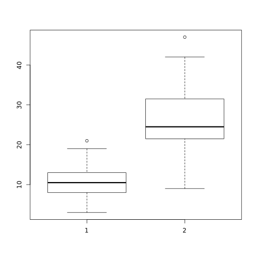
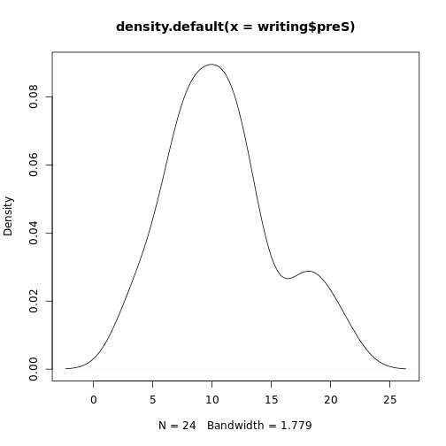
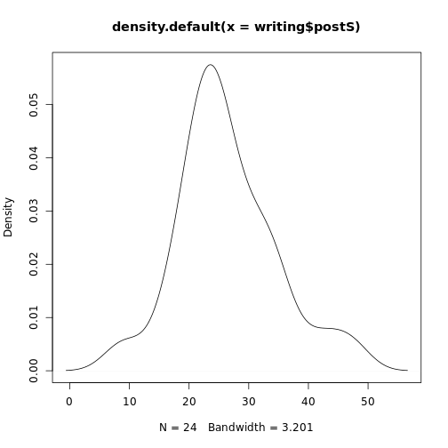
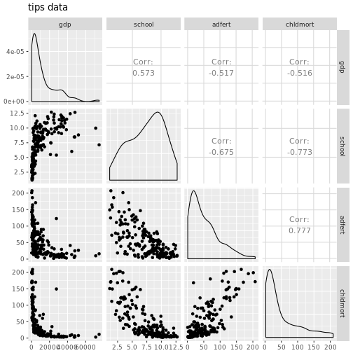

taller2-Estadística
========================================================
width: 1920
height: 1080
author: 
date: 
autosize: true

Importar funcionalidad
========================================================


```r
## install.packages("readstata13")
library(readstata13)
writing <- readstata13::read.dta13("writing.dta")
writing
```

```
   id preS preP preC preE postS postP postC postE
1   A   11    2    1    2    23     5     2     6
2   B    8    1    1    0     9     5     1     1
3   C   11    1    0    0    24     4     1     1
4   D    8    1    0    0    20     6     2     5
5   E    6    1    0    1    16     2     1     2
6   F    8    1    0    2    18     5     1     1
7   G   13    4    0    3    21     6     1     4
8   H    4    0    0    0    24     5     1     1
9   I    3    2    0    0    20     5     1     2
10  J    8    2    0    3    23     4     2     4
11  K   12    1    1    2    27     4     2     5
12  L    9    6    0    0    33     6     2     4
13  M   21    2    1    3    42     5     2     3
14  N   13    1    0    0    33     6     2     4
15  O   19    4    2    3    25     6     2     4
16  P   17    5    0    3    30     9     2     3
17  Q   14    2    1    3    47     6     2     5
18  R   12    3    0    2    24     6     2     4
19  S   18    2    1    1    34     5     2     4
20  T   10    3    0    1    36     8     1     2
21  U    7    3    0    1    22     5     1     4
22  V   10    4    0    0    29     8     1     4
23  W    6    3    0    1    25     3     2     3
24  X   11    1    0    1    28     6     2     4
```


Los datos 
========================================================
Oraciones completas antes y después del tratamientos

- preS 
- postS


```r
summary(writing[c("preS", "postS")])
```

```
      preS           postS      
 Min.   : 3.00   Min.   : 9.00  
 1st Qu.: 8.00   1st Qu.:21.75  
 Median :10.50   Median :24.50  
 Mean   :10.79   Mean   :26.38  
 3rd Qu.:13.00   3rd Qu.:30.75  
 Max.   :21.00   Max.   :47.00  
```

Gráficamente
========================================================


```r
boxplot(writing$preS, writing$postS)
```




Distribución
=======================================================

Es normal?


```r
dPre <- density(writing$preS)
plot(dPre)
```



Distribución
=======================================================

Es normal?


```r
dPost <- density(writing$postS)
plot(dPost)
```




Estadísticamente
========================================================

Prueba de hipótesis

```r
t.test(writing$postS, writing$preS )
```

```

	Welch Two Sample t-test

data:  writing$postS and writing$preS
t = 8.0441, df = 35.945, p-value = 1.492e-09
alternative hypothesis: true difference in means is not equal to 0
95 percent confidence interval:
 11.65424 19.51243
sample estimates:
mean of x mean of y 
 26.37500  10.79167 
```
- Nos da un intervalo de confianza para la diferencia de medias.


Modelos lineales
========================================================

Archivos nativos STATA

```r
nations <- readRDS("nations.rds")
summary(nations)
```

```
   country               region        gdp              school      
 Length:194         Africa  :52   Min.   :  279.8   Min.   : 1.150  
 Class :character   Americas:35   1st Qu.: 2100.3   1st Qu.: 5.225  
 Mode  :character   Asia    :49   Median : 6932.8   Median : 7.950  
                    Europe  :43   Mean   :12118.7   Mean   : 7.459  
                    Oceania :15   3rd Qu.:17576.3   3rd Qu.: 9.850  
                                  Max.   :74906.0   Max.   :12.700  
                                  NA's   :15        NA's   :6       
     adfert          chldmort           life            pop           
 Min.   :  1.00   Min.   :  2.25   Min.   :45.85   Min.   :9.767e+03  
 1st Qu.: 16.50   1st Qu.: 10.25   1st Qu.:63.75   1st Qu.:1.484e+06  
 Median : 39.35   Median : 24.00   Median :72.18   Median :6.785e+06  
 Mean   : 51.81   Mean   : 47.65   Mean   :68.73   Mean   :3.438e+07  
 3rd Qu.: 74.38   3rd Qu.: 69.75   3rd Qu.:75.55   3rd Qu.:2.226e+07  
 Max.   :207.10   Max.   :209.00   Max.   :82.77   Max.   :1.325e+09  
                  NA's   :1                                           
     urban            femlab          literacy           co2        
 Min.   : 10.25   Min.   :0.1942   Min.   : 23.60   Min.   :  0.10  
 1st Qu.: 36.33   1st Qu.:0.5782   1st Qu.: 70.10   1st Qu.:  2.25  
 Median : 56.48   Median :0.7304   Median : 89.70   Median :  8.45  
 Mean   : 55.43   Mean   :0.6916   Mean   : 81.53   Mean   : 17.89  
 3rd Qu.: 73.48   3rd Qu.:0.8206   3rd Qu.: 97.70   3rd Qu.: 25.00  
 Max.   :100.00   Max.   :1.0344   Max.   :100.00   Max.   :210.65  
                  NA's   :17       NA's   :59       NA's   :9       
      gini           loggdp          reg1          reg2       
 Min.   :19.00   Min.   :2.447   others:142   Min.   :0.0000  
 1st Qu.:34.00   1st Qu.:3.322   Africa: 52   1st Qu.:0.0000  
 Median :39.70   Median :3.841                Median :0.0000  
 Mean   :40.48   Mean   :3.776                Mean   :0.1804  
 3rd Qu.:46.20   3rd Qu.:4.245                3rd Qu.:0.0000  
 Max.   :58.50   Max.   :4.875                Max.   :1.0000  
 NA's   :113     NA's   :15                                   
      reg3            reg4          reg5             logco2       
 Min.   :0.0000   others:151   Min.   :0.00000   Min.   :-1.0000  
 1st Qu.:0.0000   Europe: 43   1st Qu.:0.00000   1st Qu.: 0.3522  
 Median :0.0000                Median :0.00000   Median : 0.9269  
 Mean   :0.2526                Mean   :0.07732   Mean   : 0.8069  
 3rd Qu.:0.7500                3rd Qu.:0.00000   3rd Qu.: 1.3979  
 Max.   :1.0000                Max.   :1.00000   Max.   : 2.3236  
                                                 NA's   :9        
    urb_reg4          urban0             loggdp0         
 Min.   :  0.00   Min.   :-45.15000   Min.   :-1.333152  
 1st Qu.:  0.00   1st Qu.:-19.07500   1st Qu.:-0.458354  
 Median :  0.00   Median :  1.07500   Median : 0.060909  
 Mean   : 15.53   Mean   :  0.03488   Mean   :-0.004271  
 3rd Qu.:  0.00   3rd Qu.: 18.08333   3rd Qu.: 0.464920  
 Max.   :100.00   Max.   : 44.60000   Max.   : 1.094517  
                                      NA's   :15         
    urb_gdp        
 Min.   :-24.4014  
 1st Qu.:  0.6885  
 Median :  6.1521  
 Mean   :  9.6186  
 3rd Qu.: 17.2818  
 Max.   : 55.8472  
 NA's   :15        
```

Explicamos la variación en esperanza de vida
========================================================
Un modelo lineal


```r
modelo_gdp <- lm(life ~ school, data=nations)
summary(modelo_gdp)
```

```

Call:
lm(formula = life ~ school, data = nations)

Residuals:
    Min      1Q  Median      3Q     Max 
-20.650  -4.058   1.529   4.747  14.393 

Coefficients:
            Estimate Std. Error t value Pr(>|t|)    
(Intercept)  50.3594     1.3692   36.78   <2e-16 ***
school        2.4518     0.1707   14.37   <2e-16 ***
---
Signif. codes:  0 '***' 0.001 '**' 0.01 '*' 0.05 '.' 0.1 ' ' 1

Residual standard error: 6.908 on 186 degrees of freedom
  (6 observations deleted due to missingness)
Multiple R-squared:  0.5259,	Adjusted R-squared:  0.5234 
F-statistic: 206.3 on 1 and 186 DF,  p-value: < 2.2e-16
```


Visualizamos la relación entre variables
========================================================

Gráficamente


```r
library(GGally)
ggpairs(data=nations, 
         columns=3:6, 
         title="tips data", 
         colour = "sex") 
```


*** 




Modelo
========================================================
Especificamos un modelo multivariado para la esperanza de vida


$life= \beta_0 + \beta_1 * school + \beta_2 * log(gdp) + \beta_3 * adfert + \beta_4 childmort$


Para estimarlo
========================================================


```r
modelo <- lm(life ~ school + log(gdp) + adfert + chldmort, data=nations)
summary(modelo)
```

```

Call:
lm(formula = life ~ school + log(gdp) + adfert + chldmort, data = nations)

Residuals:
     Min       1Q   Median       3Q      Max 
-15.4363  -1.6753   0.3561   2.2653   6.3244 

Coefficients:
              Estimate Std. Error t value Pr(>|t|)    
(Intercept) 62.2544019  3.1144342  19.989  < 2e-16 ***
school      -0.2339704  0.1558288  -1.501    0.135    
log(gdp)     1.7601685  0.3532287   4.983 1.51e-06 ***
adfert      -0.0004683  0.0096839  -0.048    0.961    
chldmort    -0.1511827  0.0098966 -15.276  < 2e-16 ***
---
Signif. codes:  0 '***' 0.001 '**' 0.01 '*' 0.05 '.' 0.1 ' ' 1

Residual standard error: 3.478 on 173 degrees of freedom
  (16 observations deleted due to missingness)
Multiple R-squared:  0.8813,	Adjusted R-squared:  0.8786 
F-statistic: 321.2 on 4 and 173 DF,  p-value: < 2.2e-16
```

Conclusiones
========================================================

- Si controlamos por el ingreso, la educación no afecta la esp.
- La relación entre la esperanza de vida y el ingreso no es lineal, pero es positiva
