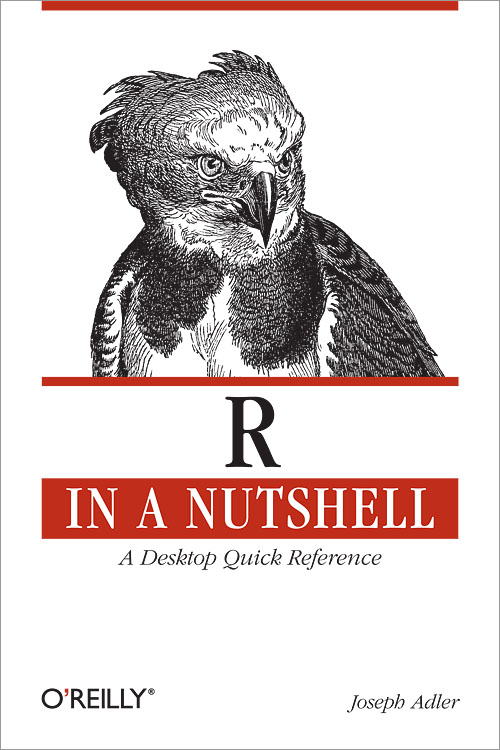
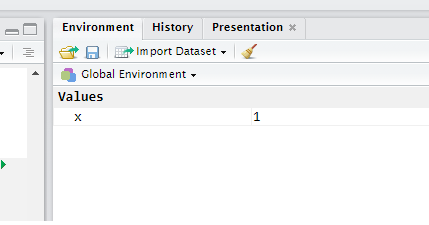

```{r setup, include=FALSE, echo=FALSE, error=FALSE, message=FALSE, warning=FALSE }
knitr::opts_chunk$set(fig.width=20, fig.height=8)
``` 
##Componentes

* Lenguaje
* Entorno de Desarrollo
* Base `R`
* Librerías

##Bibliografía

* R in a Nutshell:

<div align="left">

</div>

* `\OwnCloud\sntpc\EyM\Bibliografía\R`: Parte 2 (Caps 5-10)

##Expresiones

Pueden ser asignaciones, condicionales o aritméticos.

```{r}
x <- 1
if (x > 2) "mayor que dos" else "menor que dos"
```

##Objetos


* Los objetos son cosas 
* El código manipula objetos 

```{r}
c(1, 2, 3)
"Esto es un objeto"
```

##Objetos (2)

```{r}
list(c(1, 2, 3), "esto es otro objeto", "adentro de otro")
```


##Símbolos y enviroment

Un `environment` es un conjunto de símbolos asignados a objetos.

<div align="center">

</div>

##Funciones


* Son objetos que toman objetos como inputs (argumentos) y devuelven objetos como outputs

* Algunas vienen predefinidas:

```{r}
sum(c(1, 2, 3))
```
* Otras son definidas por el usuario:
```{r}
sumar <- function(a, b) { a + b }
sumar(1, 2)
```

##Valores Especiales


```{r}
#NA (not available/missing)
vec <- c(1, 2, 3)
vec[4]

#Inf
1/0

```
##Valores especiales (2)

```{r}
#Inf
-1/0

#NaN
Inf-Inf

#NULL
```
##Coerción

A veces `R` espera un argumento de un tipo y recibe otro, trata de transformarlo.

```{r}
if (2) "verdadero" else "falso"
```

Esto puede llevar a resultados inesperados si no lo tenemos en cuenta.


##Números


```{r}
1.1
2^1023
1+2i
# La precisión es limitada
2^1024
```


##Tipos

```{r}
typeof(1)
typeof(1:1)
typeof(1+1i)
```

##Operadores Binarios

```{r}

# Suma
1+1
# Coerción a `float`
10/3
```
##Operadores Binarios (2)

```{r}
# Integer División
10%/%3

# Módulo
10 %% 3

# Exponenciales
2^3
```

##Operadores Unarios

```{r}
# Suma
-3
!FALSE
!4

```


##Tipos

La función `sqrt` devuelve el mismo tipo que recibe:

```{r}
sqrt(-1)
sqrt(-1+0i)

```

##Estructuras de control

Controlan el flujo del programa.

```{r}
# Conditionals
x <- 1
if (x > 1) "algo" else "nada"
```

```{r}
# Conditionals (2)
x <- 1
if (x > 1) "algo" else "nada"
```

##¡Cuidado!

```{r, message=FALSE, warning=FALSE}
x <- 1:10
if (x %% 2 == 0) "par" else "impar" # Warning!
```

```{r}
# Lo que quiero es esto:
x <- 1:10
ifelse(x %% 2 == 0, "par", "impar") 
```

##Condicionales


```{r}
x <- 1
if (x==1) {
   "Uno"
} else if (x==2) {
   "Dos"
} else {
   "Mayor que dos"
 }
```

##Condicionales


```{r}
x <- "a"
switch(x,
         a="alligator",
         b="bear",
         c="camel",
         "moose")
```

##Switch Vectorial


`dplyr` tiene una versión para vectores de switch (cuidado si tienen una versión anterior a 0.7).

```{r}
suppressMessages(library(dplyr))

x <- c("a", "a", "c", "c", "b", "b", "z", "z")

case_when(x == "a" ~ "alligator",
          x == "b" ~ "bear",
          x == "c" ~ "camel",
         TRUE      ~ "moose")
```

##Loops

```{r}
for (i in seq(from=5, to=25, by=5)) print(i)
```

##Estructuras de datos

Guardan datos y permiten acceder a la información.

```{r}
x <- c(1, 2, 3, 4)
x[2]   # devuelve el elemento 2 del objeto x
x[[2]] # devuelve siempre un vector de largo 1
```

##Indexando un vector

```{r}
x <- c(1, 2, 3, 4)
x[2:4] # es igual a
x[c(2, 3, 4)]
```

```{r}
x <- c(1, 2, 3, 4)
x[-4] # es igual a

```

##Indexando una lista

```{r}
l <- list(a=1, b=2, c=3, d=4, e=5, f=6)

l[1:3]   

l$a

```
##Indexando una lista (2)

```{r}
l[-1]
```

##Indexar con un vector lógico

```{r}
x <- c(1, 2, 3, 4)
x[c(TRUE, FALSE, TRUE, FALSE)] # me quedo solo con los impares
x[x %% 2 != 0] # me quedo solo con los impares
```

##Ejercicios: Swirl

1) Instalar `swirl`

```{r eval=FALSE}
install.packages("swirl")
```
2) Cargar librería

```{r eval=FALSE}
library(swirl)
```
3) Instalar `curso`

```{r eval=FALSE}
install_course_github("ifunam", "programacion-estadistica-r")
swirl()
```


##Objetos

**Todos los valores (entidades) en R son objetos de cierto tipo (o clase).**


##Vectores


```{r}
c(.295, .300, .250, .215) # vector numérico

# Coerción
c(.295, .300, .250, "hola!") # vector de characters

# Con una lista
c(.295, .300, .250, list(.102, .303), recursive=TRUE)
```

##Vectores (2)


```{r}
# Con una lista
c(.295, .300, .250, list(.102, .303), recursive=FALSE)
```

##Indexando estructuras multidimensionales


Los `data frames` y las matrices tienen múltiples dimensiones (las listas no -> Serafín).

```{r}
x <- data_frame(x=c(1, 2, 3), y=c("a","b", "c"))
x
```

##Indexando estructuras multidimensionales (2)

```{r}
# x[[]]Devuelve un  vector de largo 1
x[[2,1]] # Fila 2, Columna 1 

# x[] Devuelve un objeto del mismo tipo que x (data_frame)
x[1,2] # Fila 1, Columna 2 
x[1,] # Fila 1, todas las columnas
x[, 2] # Todas las filas, la segunda columna 

```

##No hay objetos "sueltos"

```{r}
1 + 1
```
Es lo mismo que:
```{r}
c(1) + c(1)
```

##No hay objetos "sueltos" (2)

En general, nos interesa operar sobre vectores:
```{r}
1:10 + 1:10
1:3 * 1:3
sqrt(c(1, 2, 3, 4))
```

##Reciclando vectores

Algunos operadores "reciclan" vectores

```{r}
c(1, 2, 3, 4) / 2

```

##Listas

Pueden ser heterogéneas.

```{r}
paquete <- list(destino="Montevideo", 
                dimensiones=c(2, 6, 9), precio=12.95)
paquete$precio
paquete[["precio"]]
paquete["precio"] # ¿cuál es la diferencia?
```

##Listas (2) - agregar elementos

```{r}
z <- list(a="abc")
z
```

```{r}
z$c <- "hola"
z
```

##Listas (3)

```{r}
z[[4]] <- c(28, 30)
z[[4]]

z[5:7] <- c("uno", "dos", "tres")
z[5:7]

```

##Componentes

Los nombres de los campos:
```{r}
names(z)
```
Convertirla a un vector (con nombres):
```{r}
unlist(z)
```
##Componentes (2)
```{r}
class(z)

class(unlist(z))
```


##Listas

¡Cuidado con el tamaño!

```{r}
length(z)
```

##`lapply`

Si quiero saber el tamaño de cada elemento:

```{r}
lst <- list(a=c("algo", "nada", "todo"), b=1:3, c=c(TRUE, FALSE))
lapply(lst, length)
```
##`lapply` (2)

Si quiero saber el tipo:
```{r}
lst <- list(a=c("algo", "nada", "todo"), b=1:3, c=c(TRUE, FALSE))
lapply(lst, class)
```

##Factores


Sirven para representar información categórica.

```{r}
# Vector de characters
deptos <- c("Montevideo", "Canelones", "Montevideo", "San José",
            "Montevideo", "Montevideo", "Rivera")
typeof(deptos)
```
##Factores (2)
Alternativa:

```{r}
deptos <- factor(deptos)
levels(deptos)
deptos
```

##Factores (3)

La implementación usa `integers` (más eficiente):

```{r}
class(deptos)
```
Uso la función `unclass` para "sacarle la clase":
```{r}
deptos.int.vec <- unclass(deptos)
deptos.int.vec
class(deptos.int.vec) <- "factor" # assignment?

```

##Data Frames

Es la implementación básica de un dataset (como una planilla de Excel). 

```{r}
df <- data_frame(x=c(1, 2, 3), y=c("a","b", "c"))
typeof(df)
```

Son listas. Cada variable es un elemento de la lista.
```{r}
df$x
```

##Fechas

En general vienen como texto: hay varias funciones para convertirlas de texto a fechas.


Cuando están como fechas podemos hacer cosas con ella:

* Sacar componentes (año, mes, día)
* Calcular períodos (entre fecha y fecha)

```{r}
nac.texto <- "29/05/1984"
nac.fecha <- as.Date(nac.texto, "%d/%m/%Y")
hoy <- Sys.Date()
vida <- hoy-nac.fecha
as.numeric(vida, units="weeks") / 52 # mi edad
```


##Atributos

Sirven para almacenar metadata.

```{r}
m <- matrix(data=1:12, nrow=4, ncol=3,
 dimnames=list(c("r1", "r2", "r3", "r4"),
 c("c1", "c2", "c3")))
attributes(m)
class(m)
```
##Atributos (2)
```{r}
dim(m) <- NULL
m
class(m)
```

##Símbolos y environments

**Los nombres de las variables son símbolos**

```{r}
x <- 1
class(x) # la función class evalúa su argumento antes de 
class(quote(x))
```


##Environments

* Son el contexto en el que se evalúan las expresiones.
* Hay una tabla de correspondencia entre el símbolo y el valor


##Error


Si un símbolo no está definido en el current `environment`, `R` lo busca en su "padre".


```{r}
num <- 1
f <- function() {
  num
}
f()
```
***
```{r}

num <- 1
f <- function() {
  num <- 2
  num
}
f()
num
```

##Error (2)

Si el nombre no está definido en ningun `environment`.

```{r, error = TRUE}

foo <- function() {
  xyz +1
}
foo() # Error
```


#Error (3)

¡Esto no da error!

```{r}

df <- data_frame(x=c(1, 2, 3), y = c(3, 2, 1))
mutate(df, z=x+y)

```
¿En qué environment se evalúa z=x+y?


##Dplyr

**Las funciones de `dplyr` evalúan sus argumentos en environments distintos que las funciones "normales".**

##Otros ejemplos

* `subset`:

Lleva un data frame y un vector lógico como argumento.
```{r}
subset(mtcars, c(TRUE, FALSE, TRUE, FALSE))

subset(mtcars, mtcars$cyl == 6)
# es lo mismo que
subset(mtcars, cyl==6)


filter(mtcars, cyl ==6)

```

##Otros ejemplos: `lm`

```{r}
lm(mtcars$mpg ~ mtcars$cyl + mtcars$disp + mtcars$wt)
```

***
```{r}
# o
with(mtcars, lm(mpg ~ cyl + disp + wt))
```

##Otro: `lm`

Especifcamos un `data frame` como argumento:
```{r}
lm(mpg~cyl+disp+wt, data=mtcars)

```
##Ejercicio (2)

Una función que reemplace los `NAS` por valores. Por defecto los reemplaza por 0, si no por un valor.
```{r, eval=FALSE}
reemplazar <- function(x, val=0) {
  x[is.na(x)] <- val
  x
}
```


##Ejercicio


Una función que abra un archivo `RDS` (`data_frame.RDS`):

* Si no le ponemos argumentos, abre todo.
* Si le ponemos argumentos trae solo esas variables

```{r, echo = FALSE}

abrir <- function(file, campos=NULL) {
  df <- readRDS(file) 
  if (is.null(campos)) {
    df
  }
  else {
    df %>%
    select(one_of(campos))
  }
}

abrir("data_frame.RDS", c("a", "b"))
abrir("data_frame.RDS")

```

