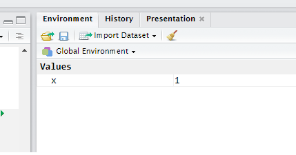

taller0 - El lenguaje R
========================================================
author: 
date: 
autosize: true


Componentes del R
========================================================

- Lenguaje
- Entorno de Desarrollo
- Base R
- Librerías

Bibliografía
========================================================


***

### \OwnCloud\sntpc\EyM\Bibliografía\R

Parte 2 [Caps 5-10]


Expresiones
========================================================

Pueden ser asignaciones, condicionales o aritméticos


```r
x <- 1
if (x > 2) "mayor que dos" else "menor que dos"
```

```
[1] "menor que dos"
```

Objetos
========================================================

Los objetos son cosas. El código manipula objetos. 


```r
c(1, 2, 3)
```

```
[1] 1 2 3
```

```r
"Esto es un objeto"
```

```
[1] "Esto es un objeto"
```

```r
list(c(1, 2, 3), "esto es otro objeto", "adentro de otro")
```

```
[[1]]
[1] 1 2 3

[[2]]
[1] "esto es otro objeto"

[[3]]
[1] "adentro de otro"
```

Símbolos y enviroment
========================================================

Un environment es un conjunto de símbolos asignados a objetos.




Funciones
========================================================

Son objetos que toman objetos como inputs (argumentos) y devuelven
objetos como outputs.

Algunas vienen predefinidas


```r
sum(c(1, 2, 3))
```

```
[1] 6
```
Definidas por usuario

```r
sumar <- function(a, b) { a + b }
sumar(1, 2)
```

```
[1] 3
```

Valores Especiales
========================================================


```r
#NA (not available/missing)
vec <- c(1, 2, 3)
vec[4]
```

```
[1] NA
```

```r
#Inf
1/0
```

```
[1] Inf
```

```r
#Inf
-1/0
```

```
[1] -Inf
```

```r
#NaN
Inf-Inf
```

```
[1] NaN
```

```r
#NULL
```

Coercion
========================================================

A veces R espera un argumento de un tipo y recibe otro, trata de transformarlo.

```r
if (2) "verdadero" else "falso"
```

```
[1] "verdadero"
```

Esto puede llevar a resultados inesperados si no lo tenemos en cuenta.


Números
========================================================


```r
# Números
1.1
```

```
[1] 1.1
```

```r
2^1023
```

```
[1] 8.988466e+307
```

```r
1+2i
```

```
[1] 1+2i
```

```r
# La precisión es limitada
2^1024
```

```
[1] Inf
```


Tipos
========================================================

```r
typeof(1)
```

```
[1] "double"
```

```r
typeof(1:1)
```

```
[1] "integer"
```

```r
typeof(1+1i)
```

```
[1] "complex"
```

Operadores Binarios
========================================================

```r
# Suma
1+1
```

```
[1] 2
```

```r
# Coercion a float
10/3
```

```
[1] 3.333333
```

```r
# Integer Division
10%/%3
```

```
[1] 3
```

```r
# Modulo
10 %% 3
```

```
[1] 1
```

```r
# Exponenciales
2^3
```

```
[1] 8
```

Operadores Unarios
========================================================

```r
# Suma
-3
```

```
[1] -3
```

```r
!FALSE
```

```
[1] TRUE
```

```r
!4
```

```
[1] FALSE
```


Tipos
========================================================

La función sqrt devuelve el mismo tipo que recibe

```r
sqrt(-1)
```

```
[1] NaN
```

```r
sqrt(-1+0i)
```

```
[1] 0+1i
```

Estructuras de control
========================================================

Controlan el flujo del programa


```r
# Conditionals
x <- 1
if (x > 1) "algo" else "nada"
```

```
[1] "nada"
```


```r
# Conditionals (2)
x <- 1
if (x > 1) "algo" else "nada"
```

```
[1] "nada"
```

Cuidado!
========================================================

```r
x <- 1:10
if (x %% 2 == 0) "par" else "impar" # Warning!
```

```
[1] "impar"
```


```r
# Lo que quiero es esto:
x <- 1:10
ifelse(x %% 2 == 0, "par", "impar") 
```

```
 [1] "impar" "par"   "impar" "par"   "impar" "par"   "impar" "par"  
 [9] "impar" "par"  
```


Condicionales
========================================================


```r
x <- 1
if (x==1) {
   "Uno"
} else if (x==2) {
   "Dos"
} else {
   "Mayor que dos"
 }
```

```
[1] "Uno"
```

Condicionales
========================================================


```r
x <- "a"
switch(x,
         a="alligator",
         b="bear",
         c="camel",
         "moose")
```

```
[1] "alligator"
```

Switch Vectorial
=========================================================

Dplyr tiene una versión para vectores de switch (cuidado si tienen una versión anterior a 0.7)


```r
suppressMessages(library(dplyr))

x <- c("a", "a", "c", "c", "b", "b", "z", "z")

case_when(x == "a" ~ "alligator",
          x == "b" ~ "bear",
          x == "c" ~ "camel",
         TRUE      ~ "moose")
```

```
[1] "alligator" "alligator" "camel"     "camel"     "bear"      "bear"     
[7] "moose"     "moose"    
```

Loops
==========================================================


```r
for (i in seq(from=5, to=25, by=5)) print(i)
```

```
[1] 5
[1] 10
[1] 15
[1] 20
[1] 25
```

Estructuras de datos
==========================================================
Guardan datos y permiten acceder a la información


```r
x <- c(1, 2, 3, 4)
x[2]   # devuelve el elemento 2 del objeto x
```

```
[1] 2
```

```r
x[[2]] # devuelve siempre un vector de largo 1
```

```
[1] 2
```

Indexando un vector
==========================================================
Guardan datos y permiten acceder a la información


```r
x <- c(1, 2, 3, 4)
x[2:4] # es igual a
```

```
[1] 2 3 4
```

```r
x[c(2, 3, 4)]
```

```
[1] 2 3 4
```


```r
x <- c(1, 2, 3, 4)
x[-4] # es igual a
```

```
[1] 1 2 3
```

Indexando una lista
==========================================================

```r
l <- list(a=1, b=2, c=3, d=4, e=5, f=6, g=7, h=8, i=9, j=10)
l[1:3]
```

```
$a
[1] 1

$b
[1] 2

$c
[1] 3
```

```r
l$a
```

```
[1] 1
```

```r
l[-1]
```

```
$b
[1] 2

$c
[1] 3

$d
[1] 4

$e
[1] 5

$f
[1] 6

$g
[1] 7

$h
[1] 8

$i
[1] 9

$j
[1] 10
```


Indexar con un vector lógico
========================================================

```r
x <- c(1, 2, 3, 4)
x[c(TRUE, FALSE, TRUE, FALSE)] # me quedo solo con los impares
```

```
[1] 1 3
```

```r
x[x %% 2 != 0] # Me quedo solo con los impares
```

```
[1] 1 3
```


Ejercicios: Swirl
========================================================


```r
# Instalar Swirl
install.packages("swirl")
# Cargar librería
library(swirl)
# instalar curs
install_course_github("ifunam", "programacion-estadistica-r")
swirl()
```


Objetos
========================================================
type: section

## Todos los valores (entidades) en R son objetos de cierto tipo (o clase).


Vectores
========================================================


```r
c(.295, .300, .250, .287, .215) # vector numérico
```

```
[1] 0.295 0.300 0.250 0.287 0.215
```

```r
# Coercion
c(.295, .300, .250, .287, "hola!") # vector de characters
```

```
[1] "0.295" "0.3"   "0.25"  "0.287" "hola!"
```

```r
# con una lista
c(.295, .300, .250, .287, list(.102, .200, .303), recursive=TRUE)
```

```
[1] 0.295 0.300 0.250 0.287 0.102 0.200 0.303
```

```r
c(.295, .300, .250, .287, list(.102, .200, .303), recursive=FALSE)
```

```
[[1]]
[1] 0.295

[[2]]
[1] 0.3

[[3]]
[1] 0.25

[[4]]
[1] 0.287

[[5]]
[1] 0.102

[[6]]
[1] 0.2

[[7]]
[1] 0.303
```
Indexando estructuras multidimensionales
========================================================

Data frames y matrices tienen múltiples dimensiones (las listas no -> Serafín)

```r
x <- data_frame(x=c(1, 2, 3), y=c("a","b", "c"))
x
```

```
# A tibble: 3 x 2
      x     y
  <dbl> <chr>
1     1     a
2     2     b
3     3     c
```

```r
# x[[]]Devuelve un  vector de largo 1
x[[2,1]] # Fila 2, Columna 1 -> 
```

```
[1] 2
```

```r
# x[] Devuelve un objeto del mismo tipo que x (data_frame)
x[1,2] # Fila 1, Columna 2 -> 
```

```
# A tibble: 1 x 1
      y
  <chr>
1     a
```

```r
x[1,] # Fila 1, todas las columnas
```

```
# A tibble: 1 x 2
      x     y
  <dbl> <chr>
1     1     a
```

```r
x[, 2] # Todas las filas, la segunda columna 
```

```
# A tibble: 3 x 1
      y
  <chr>
1     a
2     b
3     c
```

No hay objetos "sueltos"
========================================================


```r
1 + 1
```

```
[1] 2
```

```r
# es lo mismo que 
c(1) + c(1)
```

```
[1] 2
```

En general, nos interesa operar sobre vectores:

```r
1:10 + 1:10
```

```
 [1]  2  4  6  8 10 12 14 16 18 20
```

```r
1:3 * 1:3
```

```
[1] 1 4 9
```

```r
sqrt(c(1, 2, 3, 4))
```

```
[1] 1.000000 1.414214 1.732051 2.000000
```

Reciclando vectores
=======================================================
Algunos operadores "reciclan" vectores


```r
c(1, 2, 3, 4) / 2
```

```
[1] 0.5 1.0 1.5 2.0
```

Listas
========================================================
Pueden ser heterogéneas


```r
paquete <- list(destino="Montevideo", dimensiones=c(2, 6, 9), precio=12.95)
paquete$precio
```

```
[1] 12.95
```

```r
paquete[["precio"]]
```

```
[1] 12.95
```

```r
paquete["precio"] # cuál es la diferencia?
```

```
$precio
[1] 12.95
```

Listas - Agregar elementos
==============================================================
Agregar elementos

```r
z <- list(a="abc", b=12)
z
```

```
$a
[1] "abc"

$b
[1] 12
```


```r
z$c <- "hola"
z
```

```
$a
[1] "abc"

$b
[1] 12

$c
[1] "hola"
```

Listas
=============================================


```r
z[[4]] <- c(28, 30)
z[5:7] <- c("uno", "dos", "tres")
z
```

```
$a
[1] "abc"

$b
[1] 12

$c
[1] "hola"

[[4]]
[1] 28 30

[[5]]
[1] "uno"

[[6]]
[1] "dos"

[[7]]
[1] "tres"
```

Componentes
===========================================

```r
# los nombres de los campos
names(z)
```

```
[1] "a" "b" "c" ""  ""  ""  "" 
```

```r
# convertirla a un vector (con nombres)
unlist(z)
```

```
     a      b      c                                    
 "abc"   "12" "hola"   "28"   "30"  "uno"  "dos" "tres" 
```

```r
class(z)
```

```
[1] "list"
```

```r
class(unlist(z))
```

```
[1] "character"
```


Listas
==============================================
Cuidado con el tamaño


```r
length(z)
```

```
[1] 7
```

Lapply
==================================================
Si quiero saber el tamaño de cada elemento

```r
lst <- list(a=c("algo", "nada", "todo"), b=1:3, c=c(TRUE, FALSE))
lapply(lst, length)
```

```
$a
[1] 3

$b
[1] 3

$c
[1] 2
```
***
Si quiere saber el tipo

```r
lst <- list(a=c("algo", "nada", "todo"), b=1:3, c=c(TRUE, FALSE))
lapply(lst, class)
```

```
$a
[1] "character"

$b
[1] "integer"

$c
[1] "logical"
```


Listas - Eliminar elementos 
========================================================


```r
z$b <- NULL
z
```

```
$a
[1] "abc"

$c
[1] "hola"

[[3]]
[1] 28 30

[[4]]
[1] "uno"

[[5]]
[1] "dos"

[[6]]
[1] "tres"
```

Ejemplo
==================================================


```r
findwords <- function(tf) {
  txt <- scan(tf, "")
  wl <- list()
  for (i in 1:length(txt)) {
    wrd <- txt[i]
    wl[[wrd]] <- c(wl[[wrd]], i)
    
  }
  return(wl)
}


alphawl <- function(wrdlst) {
  nms <- names(wrdlst)
  sn <- sort(nms)
  return(wrdlst[sn])
}

freqwl <- function(wrdlst) {
  freqs <- sapply(wrdlst, length)
  return(wrdlst[order(freqs)])
}
```


Factores
========================================================

Sirven para representar información categórica


```r
# Vector de chars
deptos <- c("Montevideo", "Canelones", "Montevideo", "San José",
 "Montevideo", "Montevideo", "Rivera")
typeof(deptos)
```

```
[1] "character"
```

Alternativa

```r
deptos <- factor(deptos)
levels(deptos)
```

```
[1] "Canelones"  "Montevideo" "Rivera"     "San José"  
```

```r
deptos
```

```
[1] Montevideo Canelones  Montevideo San José   Montevideo Montevideo
[7] Rivera    
Levels: Canelones Montevideo Rivera San José
```

Factores (2)
==========================================================

La implementación usa integers (más eficiente)

```r
class(deptos)
```

```
[1] "factor"
```

```r
# uso la función unclass para "sacarle la clase"
deptos.int.vec <- unclass(deptos)
deptos.int.vec
```

```
[1] 2 1 2 4 2 2 3
attr(,"levels")
[1] "Canelones"  "Montevideo" "Rivera"     "San José"  
```

```r
class(deptos.int.vec) <- "factor" # assignment?
```

Data Frames
========================================================

Es la implementación básica de un dataset (como una planilla de Excel). 


```r
df <- data_frame(x=c(1, 2, 3), y=c("a","b", "c"))
typeof(df)
```

```
[1] "list"
```

Son listas. Cada variable es un elemento de la lista.

```r
df$x
```

```
[1] 1 2 3
```

Fechas
========================================================
En general vienen como texto. Hay varias funciones para convertirlas de texto a fechas.


Cuando estan como fechas podemos hacer cosas con ella:
* Sacar componentes (año, mes, día)
* Calcular períodos (entre fecha y fecha)


```r
nac.texto <- "29/05/1984"
nac.fecha <- as.Date(nac.texto, "%d/%m/%Y")
hoy <- Sys.Date()
vida <- hoy-nac.fecha
as.numeric(vida, units="weeks") / 52 # mi edad
```

```
[1] 33.53571
```


Atributos
========================================================
Sirven para almacenar metadata


```r
m <- matrix(data=1:12, nrow=4, ncol=3,
 dimnames=list(c("r1", "r2", "r3", "r4"),
 c("c1", "c2", "c3")))
attributes(m)
```

```
$dim
[1] 4 3

$dimnames
$dimnames[[1]]
[1] "r1" "r2" "r3" "r4"

$dimnames[[2]]
[1] "c1" "c2" "c3"
```

```r
class(m)
```

```
[1] "matrix"
```


```r
dim(m) <- NULL
m
```

```
 [1]  1  2  3  4  5  6  7  8  9 10 11 12
```

```r
class(m)
```

```
[1] "integer"
```


Símbolos y environments
========================================================
type: section


Nombres (Símbolos)
=======================================================
Los nombres de las variables son símbolos


```r
x <- 1
class(x) # la función class evalúa su argumento antes de 
```

```
[1] "numeric"
```

```r
class(quote(x))
```

```
[1] "name"
```


Environments
=======================================================

* Son el contexto en el que se evalúan las expresiones.
* Hay una tabla de correspondencia entre el símbolo y el valor


Environments
=======================================================

Si un simbolo no está definido en el current environment, R lo busca en su "padre"


```r
num <- 1
f <- function() {
  num
}
f()
```

```
[1] 1
```
***

```r
num <- 1
f <- function() {
  n <- 2
  num
}
f()
```

```
[1] 1
```

with, within

Error (2)
=======================================================
Si el nombre no esta definido en ningun environment


```r
f <- function() {
  num
}
#foo() Error
```


Error (3)
=======================================================
Esto no da error!


```r
df <- data_frame(x=c(1, 2, 3), y = c(3, 2, 1))
mutate(df, z=x+y)
```

```
# A tibble: 3 x 3
      x     y     z
  <dbl> <dbl> <dbl>
1     1     3     4
2     2     2     4
3     3     1     4
```
¿En qué environment se evalúa z=x+y?


Dplyr
=====================================================
Las funciones de dplyr evalúan sus argumentos en environments distintos que
las funciones "normales"

Otros ejemplos
=====================================================

Subset

```r
subset(mtcars, mtcars$cyl == 6)
```

```
                mpg cyl  disp  hp drat    wt  qsec vs am gear carb
Mazda RX4      21.0   6 160.0 110 3.90 2.620 16.46  0  1    4    4
Mazda RX4 Wag  21.0   6 160.0 110 3.90 2.875 17.02  0  1    4    4
Hornet 4 Drive 21.4   6 258.0 110 3.08 3.215 19.44  1  0    3    1
Valiant        18.1   6 225.0 105 2.76 3.460 20.22  1  0    3    1
Merc 280       19.2   6 167.6 123 3.92 3.440 18.30  1  0    4    4
Merc 280C      17.8   6 167.6 123 3.92 3.440 18.90  1  0    4    4
Ferrari Dino   19.7   6 145.0 175 3.62 2.770 15.50  0  1    5    6
```

```r
# es lo mismo que
subset(mtcars, cyl==6)
```

```
                mpg cyl  disp  hp drat    wt  qsec vs am gear carb
Mazda RX4      21.0   6 160.0 110 3.90 2.620 16.46  0  1    4    4
Mazda RX4 Wag  21.0   6 160.0 110 3.90 2.875 17.02  0  1    4    4
Hornet 4 Drive 21.4   6 258.0 110 3.08 3.215 19.44  1  0    3    1
Valiant        18.1   6 225.0 105 2.76 3.460 20.22  1  0    3    1
Merc 280       19.2   6 167.6 123 3.92 3.440 18.30  1  0    4    4
Merc 280C      17.8   6 167.6 123 3.92 3.440 18.90  1  0    4    4
Ferrari Dino   19.7   6 145.0 175 3.62 2.770 15.50  0  1    5    6
```

Otros ejemplos: lm
======================================================


```r
lm(mtcars$mpg ~ mtcars$cyl + mtcars$disp + mtcars$wt)
```

```

Call:
lm(formula = mtcars$mpg ~ mtcars$cyl + mtcars$disp + mtcars$wt)

Coefficients:
(Intercept)   mtcars$cyl  mtcars$disp    mtcars$wt  
  41.107678    -1.784944     0.007473    -3.635677  
```

***

```r
# o
with(mtcars, lm(mpg ~ cyl + disp + wt))
```

```

Call:
lm(formula = mpg ~ cyl + disp + wt)

Coefficients:
(Intercept)          cyl         disp           wt  
  41.107678    -1.784944     0.007473    -3.635677  
```

Otro: lm
====================================================
Especifcamos un data frame como argumento

```r
lm(mpg~cyl+disp+wt, data=mtcars)
```

```

Call:
lm(formula = mpg ~ cyl + disp + wt, data = mtcars)

Coefficients:
(Intercept)          cyl         disp           wt  
  41.107678    -1.784944     0.007473    -3.635677  
```

Funciones
========================================================
type: section
