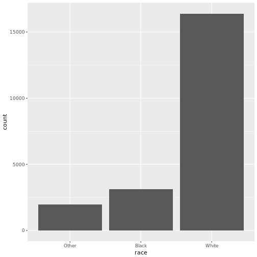
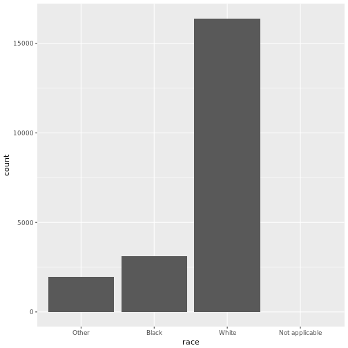
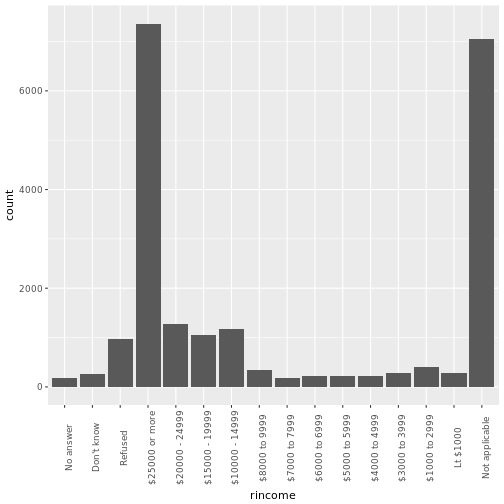
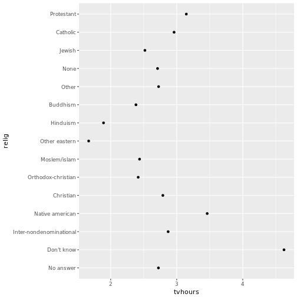
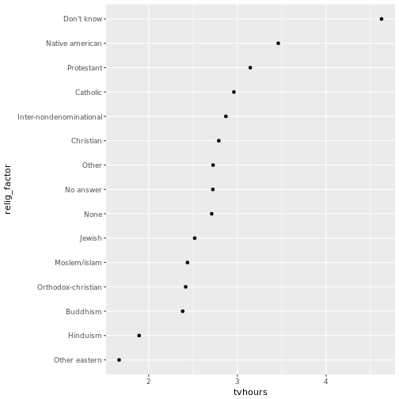
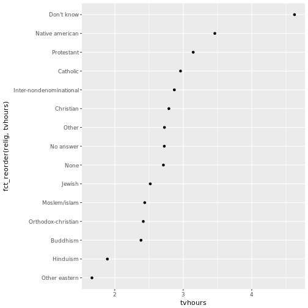
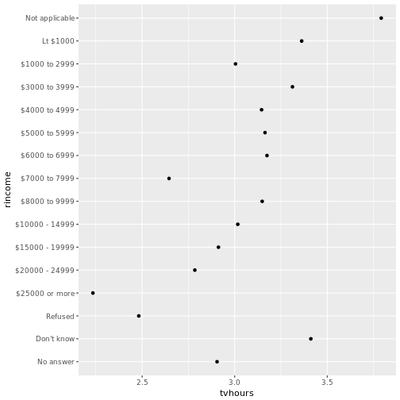
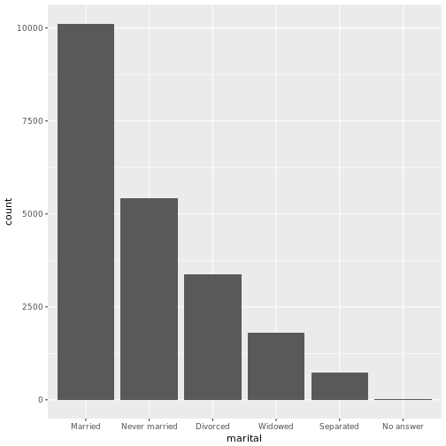
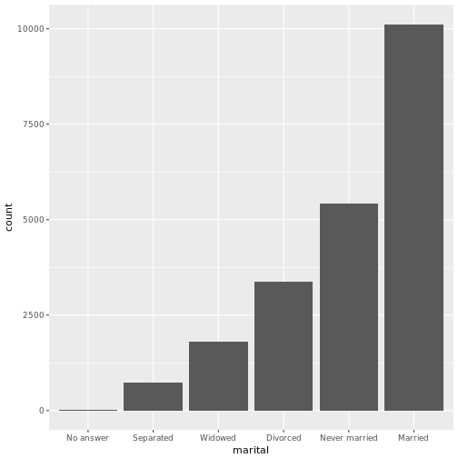

Taller 6 - Factores y Fechas
========================================================
author: 
date: 
autosize: true

Forcats
========================================================

Como muchos de los packages del tidyverse, la idea es simplificar y unificar las interfases.

Factores
========================================================
Sirven para modelar variables categóricas


```r
x1 <- c("Dec", "Abr", "Ene", "Mar")
x1
```

```
[1] "Dec" "Abr" "Ene" "Mar"
```

Problemas de usar texto
=============================================================
Orden

```r
sort(x1)
```

```
[1] "Abr" "Dec" "Ene" "Mar"
```

Errores de tipeo

```r
x2 <- c("Dec", "Abr", "Ene", "Marzo")
```

Factores
=============================================================
Evitan estos problemas

```r
niveles <- c("Ene", "Feb", "Mar", "Abr", 
            "May", "Jun", "Jul", "Ag",
           "Set", "Oct", "Nov", "Dec")
```


```r
x1
```

```
[1] "Dec" "Abr" "Ene" "Mar"
```

```r
meses_factor <- factor(x1, levels=niveles)
sort(meses_factor)
```

```
[1] Ene Mar Abr Dec
Levels: Ene Feb Mar Abr May Jun Jul Ag Set Oct Nov Dec
```
Errores
===========================================================
Si hay un error:

```r
x2
```

```
[1] "Dec"   "Abr"   "Ene"   "Marzo"
```

```r
meses_factor_2 <- factor(x2, levels=niveles)
meses_factor_2
```

```
[1] Dec  Abr  Ene  <NA>
Levels: Ene Feb Mar Abr May Jun Jul Ag Set Oct Nov Dec
```

Ejemplos con una encuesta
==========================================================

```r
library(dplyr)
library(forcats)
head(gss_cat)
```

```
# A tibble: 6 x 9
   year       marital   age   race        rincome            partyid
  <int>        <fctr> <int> <fctr>         <fctr>             <fctr>
1  2000 Never married    26  White  $8000 to 9999       Ind,near rep
2  2000      Divorced    48  White  $8000 to 9999 Not str republican
3  2000       Widowed    67  White Not applicable        Independent
4  2000 Never married    39  White Not applicable       Ind,near rep
5  2000      Divorced    25  White Not applicable   Not str democrat
6  2000       Married    25  White $20000 - 24999    Strong democrat
# ... with 3 more variables: relig <fctr>, denom <fctr>, tvhours <int>
```
Vamos a usar ggplot para graficar los datos, pero podrían ser tablas


Barchart con ggplot
=========================================================


```r
library(ggplot2)
ggplot(gss_cat, aes(x=race)) + geom_bar()
```


***

```r
ggplot(gss_cat, aes(x=race)) + geom_bar() + scale_x_discrete(drop=FALSE)
```



Distribución
=======================================================
Explorar la distribución de rincome

```r
ggplot(gss_cat, aes(x=rincome)) + geom_bar() + theme(axis.text.x=element_text(angle=90))
```




Horas de mirar TV para cada religión
===================================================


```r
relig <- gss_cat %>% 
  group_by(relig) %>%
  summarize(
    age=mean(age, na.rm=TRUE),
    tvhours=mean(tvhours, na.rm=TRUE),
    n=n()
  )

ggplot(relig, aes(tvhours, relig)) + geom_point()
```



Reordenar las religiones
=================================================
Como son un factor, puedo usar fct_reorder
Esta función lleva: un factor y un vector numérico, y me devuelve el mismo factor pero con los niveles reordenados


```r
relig <- relig %>% mutate(relig_factor = fct_reorder(relig, tvhours))
ggplot(relig, aes(tvhours, relig_factor)) + geom_point()
```


***
Tangente: en el libro está así:

```r
ggplot(relig, aes(tvhours, fct_reorder(relig, tvhours))) + geom_point()
```



Otra variable
====================================================

```r
rincome <- gss_cat %>%
  group_by(rincome) %>%
  summarize(
    age = mean(age, na.rm=TRUE),
    tvhours = mean(tvhours, na.rm=TRUE),
    n=n()
  )

ggplot(rincome,
       aes(tvhours, rincome)) + geom_point()  
```



El orden de los factores...
===================================================
No tiene sentido reordenarlos por otra variable como en el caso anterior.
Sin embargo, podemos querer mandar algunos para adelante para resaltarlos:

```r
ggplot(rincome,
       aes(tvhours, relevel(rincome, "Not applicable"))) + geom_point()
```


Reordenar por frecuencia
===================================================
fct_infreq


```r
gss_cat %>%
mutate(marital = marital %>% fct_infreq() ) %>%
ggplot(aes(marital)) +
geom_bar()
```


***
fct_rev lo revierte


```r
gss_cat %>%
mutate(marital = marital %>% fct_infreq() %>% fct_rev()) %>%
ggplot(aes(marital)) +
geom_bar()
```




Recodificar los factores
=============================================

```r
gss_cat %>% count(partyid)
```

```
# A tibble: 10 x 2
              partyid     n
               <fctr> <int>
 1          No answer   154
 2         Don't know     1
 3        Other party   393
 4  Strong republican  2314
 5 Not str republican  3032
 6       Ind,near rep  1791
 7        Independent  4119
 8       Ind,near dem  2499
 9   Not str democrat  3690
10    Strong democrat  3490
```

Recodificar los factores (2)
=============================================

```r
gss_cat %>% 
  mutate(
    partyid = fct_recode(partyid,
         "Republican, strong" = "Strong republican",
         "Republican, weak" = "Not str republican",
         "Independent, near rep" = "Ind,near rep",
         "Independent, near dem" = "Ind,near dem",
         "Democrat, weak" = "Not str democrat",
         "Democrat, strong" = "Strong democrat"
    )) %>%
  count(partyid)
```

```
# A tibble: 10 x 2
                 partyid     n
                  <fctr> <int>
 1             No answer   154
 2            Don't know     1
 3           Other party   393
 4    Republican, strong  2314
 5      Republican, weak  3032
 6 Independent, near rep  1791
 7           Independent  4119
 8 Independent, near dem  2499
 9        Democrat, weak  3690
10      Democrat, strong  3490
```

Agrupaciones - fct_recode
===============================================


```r
gss_cat %>%
mutate(partyid = fct_recode(partyid,
"Republican" = "Strong republican",
"Republican" = "Not str republican",
"Other" = "Ind,near rep",
"Other" = "Ind,near dem",
"Democrat" = "Not str democrat",
"Democrat" = "Strong democrat",
"Other" = "No answer",
"Other" = "Don't know",
"Other" = "Other party"
)) %>%
count(partyid)
```

```
# A tibble: 4 x 2
      partyid     n
       <fctr> <int>
1       Other  4838
2  Republican  5346
3 Independent  4119
4    Democrat  7180
```
Agrupaciones - fct_collapse
===============================================


```r
gss_cat %>%
mutate(partyid = fct_collapse(partyid,
  other = c("No answer", "Don't know", "Other party"),
  rep = c("Strong republican", "Not str republican"),
  ind = c("Ind,near rep", "Independent", "Ind,near dem"),
  dem = c("Not str democrat", "Strong democrat")
)) %>%
count(partyid)
```

```
# A tibble: 4 x 2
  partyid     n
   <fctr> <int>
1   other   548
2     rep  5346
3     ind  8409
4     dem  7180
```

Agrupaciones - fct_lump
===============================================
Colapsa los factores chicos en un "otros"


```r
gss_cat %>%
  mutate(relig = fct_lump(relig, n = 10)) %>%
  count(relig, sort = TRUE)
```

```
# A tibble: 10 x 2
                     relig     n
                    <fctr> <int>
 1              Protestant 10846
 2                Catholic  5124
 3                    None  3523
 4               Christian   689
 5                   Other   458
 6                  Jewish   388
 7                Buddhism   147
 8 Inter-nondenominational   109
 9            Moslem/islam   104
10      Orthodox-christian    95
```

Preguntas
==========================================
* ¿Qué pasa con los valores altos de tvhours?
* Identificar para todos los facotres de gss_cat si son ordenados o arbitrarios
* Cómo cambian las proporciones de democratas, republicanos e independientes?
* Colapsar rincome en menos categorías

Preguntas (2)
=========================================
Identificar un factor en cada base:
ZZFF (zona_franca, seccion)


Fechas
================================================
section:true
