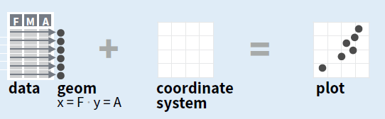
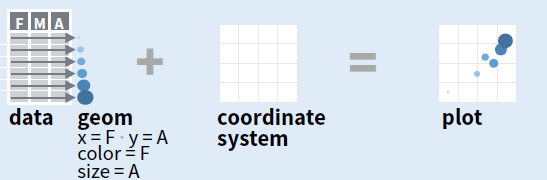
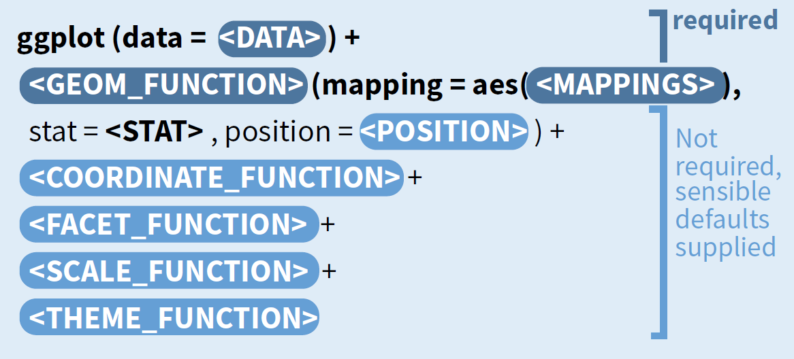

## ¿Qué es ggplot2?

- es el paquete de gráficos estadísticos más importante de R
- ggplot2 está basado en la "gramática de gráficos" (Grammar of Graphics), la idea por detrás es que se puede construir cualquier gráfico con los mismos componentes: un set de datos, un sistema de coordenadas y geoms (marcas visuales que representan puntos de datos)

## ¿Cómo se construye un gráfico en ggplot2?

- en primer lugar, se asocian las variables del set de datos a los geoms y a un determinado sistema de coordenadas

<div align="center">

</div>
- luego se mapean las variables con propiedades visuales de los geoms como color y tamaño 

<div align="center">

</div>


## Sobre ggplot2

- muy flexible
- fácil de aprender
- posee un sistema de $themes$ que permite hacer más prolija la apariencia de los gráficos (http://www.ggplot2-exts.org/ggthemes.html)
- es un sistema maduro y completo

## Instalar ggplot2

```{r, message=FALSE}
install.packages("ggplot2", repos = "http://cran.us.r-project.org")
library(ggplot2)
```

## La receta básica

<div align="center">

</div>

## Ejemplo: propina

```{r}
# cargamos los datos 
tips <- read.csv("http://www.ggobi.org/book/data/tips.csv")
head(tips)
```
```{r}

```


## Tres elementos básicos de cualquier gráfico

- data: datos -> tips

- aes: un conjunto de mapeos estéticos entre las variables en los datos y las propiedades visuales -> totbill mapeado en el eje de las x , tip mapeado en el eje de las y

- layer: al menos una capa que describe como representar cada observación, las capas son creadas con la función geom -> puntos mediante geom_point

## Gráfico: relación entre el valor total de la cuenta y la propina


```{r, fig.width=4, fig.height=4}
ggplot(data = tips, aes(x = totbill, y = tip)) +  geom_point() 
```

## ¿Qué vemos en el gráfico anterior?

- Hay una relación lineal débil entre propina y la cuenta total
- Hay mucha variabilidad

## Color, tamaño, forma y otros aes

Para agregar otras variables al plot podemos usar otros aes como color, forma o tamaño.

```{r, eval=FALSE}
aes(x = totbill, y = tip, colour = sex)

aes(x = totbill, y = tip, shape = sex)

aes(x = totbill, y = tip, size = size)
```

##Color

```{r}
ggplot(data = tips, aes(x = totbill, y = tip, colour = sex)) +
  geom_point() 
```

##Color fijo

Si queremos fijar un estético a un color fijo, hay que hacerlo en la capa de afuera (sin aes).

```{r, fig.width=4, fig.height=3.5}
ggplot(data = tips, aes(x = totbill, y = tip) )+
  geom_point(colour = "blue") 
```

##Forma

```{r}
ggplot(data = tips, aes(x = totbill, y = tip, shape = sex)) +
  geom_point() 
```

##Tamaño

```{r}
ggplot(data = tips, aes(x = totbill, y = tip, size = size)) +
  geom_point(alpha = 1 / 3) 
```

##Tamaño


```{r}
ggplot(data = tips, aes(x = totbill, y = tip) ) +
  geom_point(size = 5, alpha = 1 / 3) 
```

##Faceteado


- Se pueden desplegar variables categóricas adicionales en un plot usando faceteado

- Crea tablas de gráficos partiendo los datos en subconjuntos y mostrándolos el mismo gráfico para cada subconjunto

Dos tipos: i) facet_grid and ii) facet_wrap

##Faceteado con facet_wrap

- sirve para una variable
- devuelve tantos gráficos como niveles de la variable

```{r, fig.width=5, fig.height=3.2}
ggplot(data = tips, aes(x = totbill, y = tip)) +
  geom_point() +
 facet_wrap( ~sex)
```

##Faceteado con facet_grid: dos variables

```{r, eval=FALSE}
facet_grid(variable fila, variable columna)
```
```{r, fig.width=5, fig.height=3.5}
ggplot(data = tips, aes(x = totbill, y = tip)) +
  geom_point() +
 facet_grid(sex~ smoker)
```

##Faceteado con facet_grid: una variable (fila)

```{r, eval=FALSE}
facet_grid(variable fila ~.)
```
```{r, fig.width=4, fig.height=3}
ggplot(data = tips, aes(x = totbill, y = tip)) +
  geom_point() +
 facet_grid(sex~.)
```

##Faceteado con facet_grid: una variable (columna)

```{r, eval=FALSE}
facet_grid(.~ variable columna)
```
```{r, fig.width=4, fig.height=3}
ggplot(data = tips, aes(x = totbill, y = tip)) +
  geom_point() +
 facet_grid(.~sex)
```

##Sustituyendo geom_point() por otros geoms

Cuando sustituímos geom_point() por otro geom obtenemos un plot distinto. Los geom más comunes:

- geom_smooth()
- geom_boxplot()
- geom_histogram()
- geom_bar()
- geom_path() y geom_lines()

##Suavizar el scatterplot

Si el scatterplot tiene mucho ruido se puede usar un suavizado para facilitar la visualización del patrón dominante usando geom_smooth(). Distintos métodos de suavizado por ejemplo: lm, glm, gam, loess y rlm.

```{r, fig.width=4, fig.height=2.8, message=FALSE}
ggplot(data = tips, aes(x = totbill, y = tip)) +
  geom_point() + 
  geom_smooth()
```

##Incluir un suavizado lineal

```{r, fig.width=7, fig.height=4.2}
ggplot(data = tips, aes(x = totbill, y = tip)) +
  geom_point() + 
  geom_smooth(method = "lm")
```

##Incluir un suavizado lineal y línea

```{r, fig.width=7, fig.height=3.5}
tips.lm <- lm(tip ~ totbill, data = tips)
coef <- tips.lm$coefficients
ggplot(data = tips, aes(x = totbill, y = tip)) +
  geom_point() + 
  geom_abline(intercept = coef[[1]] , slope = coef[[2]] )
```

##Incluir etiquetas

```{r, fig.width=7, fig.height=4}
ggplot(data = tips, aes(x = totbill, y = tip, colour = sex)) +
  geom_point() + labs(x = "Total de la cuenta", y = "Propina", 
                      colour = "Sexo") +
  ggtitle("Valor total de la cuenta y la propina según sexo")
```

##A PRACTICAR: propuesta 1

Con una muestra de 1000 observaciones de la base $diamonds$:
```{r, eval=FALSE}
dsamp <- diamonds[sample(nrow(diamonds), 1000), ]
```
- Elaborar scatter plot de $price$ versus $carat$ (peso de los diamantes)
- Incluir usando $labs$(etiquetas) el nombre de los ejes, título informativo y nombre de la leyenda
- Colorear usando la variable $cut$
- Usar transparencias para el sobre ploteado $alpha$

##Base $diamonds$ para practicar

```{r}
head(diamonds)
```

##Propuesta 1: solución


```{r}
dsamp <- diamonds[sample(nrow(diamonds), 1000), ]
```
```{r, fig.width=7, fig.height=3}
ggplot(data = dsamp, aes(x = price, y = carat, colour = cut)) +
  geom_point(alpha = 1 / 3) + 
  labs(x = "Precio en dólares", y = "Peso de los diamantes", 
                      colour = "Corte") + 
    ggtitle("Precio en dólares de los diamantes según peso") 
```

##A PRACTICAR: propuesta 2

- Utilizando el plot anterior, cambiar la paleta de colores a "Purples"
- Chequear la ayuda de ?scale_colour_brewer
```{r}
?scale_colour_brewer
```

##Propuesta 2: solución


```{r, fig.width=7, fig.height=3.5}
ggplot(data = dsamp, aes(x = price, y = carat, colour = cut)) +
  geom_point(alpha = 1 / 3) + 
  labs(x = "Precio en dólares", y = "Peso de los diamantes", 
                      colour = "Corte")+ 
    ggtitle("Precio en dólares de los diamantes según peso") +
    scale_colour_brewer(palette = "Purples")
```

##A PRACTICAR: propuesta 3

- $scale$ controla el mapeo de los datos a los elementos estéticos
- El argumento $breaks$ controla los valores que aparecen en las líneas de división de los ejes y tienen asociado una etiqueta que está controlada por $label$
- Sobre el plot inicial, cambiar las líneas de división en el eje de las y a 1, 2 y 3 con las etiquetas 1 oz, 2 oz y 3 oz
- ?scale_y_continuous

##Propuesta 3: solución

```{r, fig.width=7, fig.height=2.5}
ggplot(data = dsamp, aes(x = price, y = carat, colour = cut)) +
  geom_point(alpha = 1 / 3) + 
  labs(x = "Precio en dólares", y = "Peso de los diamantes", 
                      colour = "Corte")+ 
    ggtitle("Precio en dólares de los diamantes según peso") +
    scale_colour_brewer(palette = "Purples") + 
  scale_y_continuous(
  breaks = c(1, 2, 3),
  label = c("1 oz", "2 oz", "3 oz"))
```

##A PRACTICAR: propuesta 4

Usar la variable $cut$ para crear un gráfico para cada subconjunto (usar transparencias para el sobre ploteado alpha).

```{r}
?facet_wrap
``` 

##Propuesta 4: solución

```{r, fig.width=7, fig.height=3.5}
ggplot(data = dsamp, aes(x = price, y = carat, colour = cut)) +
  geom_point(alpha = 1 / 3) + 
  labs(x = "Precio en dólares", y = "Peso de los diamantes", 
                      colour = "Corte")+ 
    ggtitle("Precio en dólares de los diamantes según peso") +
 facet_wrap( ~cut)
```

##Para conocer más...

- http://ggplot2.tidyverse.org/
- Libro para salir del paso: "R Graphics Cookbook" http://www.cookbook-r.com/Graphs/
- Libro para ir más a fondo y entender el lenguaje que sustenta a ggplot2: "ggplot2: Elegant Graphics for Data Analysis" https://github.com/hadley/ggplot2-book
- Cheatsheets de RStudio: https://www.rstudio.com/wp-content/uploads/2015/03/ggplot2-cheatsheet.pdf https://github.com/rstudio/cheatsheets/raw/master/data-visualization-2.1.pdf
- http://tutorials.iq.harvard.edu/R/Rgraphics/Rgraphics.html


