Visualización de datos con ggplot2
========================================================
author: Paula Pereda
date: jueves 15 de marzo
autosize: true


========================================================
¿Qué es ggplot2?

- ggplot2 es un paquete de R que está basado en la "gramática de gráficos" (Grammar of Graphics), la idea por detrás es que se puede construir cualquier gráfico con los mismos componentes: un set de datos, un set de marcas geométricas que representan los puntos de datos y un sistema de coordenadas.

- es el paquete de gráficos estadísticos más importante en R

Sobre ggplot2
========================================================
- muy flexible
- fácil de aprender
- posee un sistema de $themes$ que permite hacer más prolija la apariencia de los gráficos
- es un sistema maduro y completo

Componentes de los gráficos
========================================================
- datos
- mapeo estético
- capas: i) objeto geométrico (geoms: puntos, líneas, rectángulos, texto, etc.), ii) transformaciones estadísticas (stats, son identidades, conteos, bins, etc.)
- sistema de coordenadas (normalmente cartesianas, pero también: pie charts, polar, etc.)
- ajustes de posición
- facetas (cómo se arregla el display cuando son muchos gráficos)
- "themes" (temas: ítems para mejorar el dibujo como pueden ser: fuente, tamaño color, fondo, etc.)

Instalar ggplot2
========================================================


```r
install.packages("ggplot2", repos = "http://cran.us.r-project.org")
library(ggplot2)
```

Ejemplo: propina
========================================================

```r
# cargamos los datos 
tips <- read.csv("http://www.ggobi.org/book/data/tips.csv")
head(tips)
```

```
  obs totbill  tip sex smoker day  time size
1   1   16.99 1.01   F     No Sun Night    2
2   2   10.34 1.66   M     No Sun Night    3
3   3   21.01 3.50   M     No Sun Night    3
4   4   23.68 3.31   M     No Sun Night    2
5   5   24.59 3.61   F     No Sun Night    4
6   6   25.29 4.71   M     No Sun Night    4
```
Tres elementos básicos de cualquier gráfico
========================================================
1) data: datos -> tips

2) aes: un conjunto de mapeos estéticos entre las variables en los datos y las propiedades visuales -> totbill mapeado en el eje de las x , tip mapeado en el eje de las y

3) layer: al menos una capa que describe como representar cada observación, las capas son creadas con la función geom -> puntos mediante geom_point

Gráfico: relación entre el valor total de la cuenta y la propina
========================================================


```r
ggplot(data = tips, aes(x = totbill, y = tip)) +  geom_point() 
```


¿Qué vemos en el gráfico anterior?
========================================================

- Hay una relación lineal débil entre propina y la cuenta total

- Hay mucha variabilidad

Color, tamaño, forma y otros aes
========================================================

Para agregar otras variables al plot podemos usar otros aes como color, forma o tamaño.


```r
aes(x = totbill, y = tip, colour = sex)

aes(x = totbill, y = tip, shape = sex)

aes(x = totbill, y = tip, size = size)
```

Color
========================================================

```r
ggplot(data = tips, aes(x = totbill, y = tip, colour = sex)) +
  geom_point() 
```

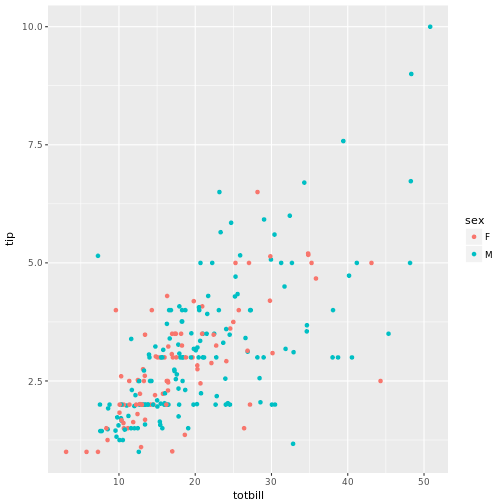

Color fijo
========================================================
Si queremos fijar un estético a un color fijo, hay que hacerlo en la capa de afuera (sin aes).


```r
ggplot(data = tips, aes(x = totbill, y = tip) )+
  geom_point(colour = "blue") 
```

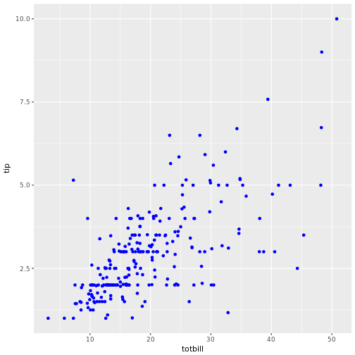

Forma
========================================================

```r
ggplot(data = tips, aes(x = totbill, y = tip, shape = sex)) +
  geom_point() 
```

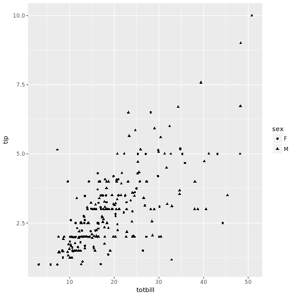

Tamaño
========================================================

```r
ggplot(data = tips, aes(x = totbill, y = tip, size = size)) +
  geom_point(alpha = 1 / 3) 
```

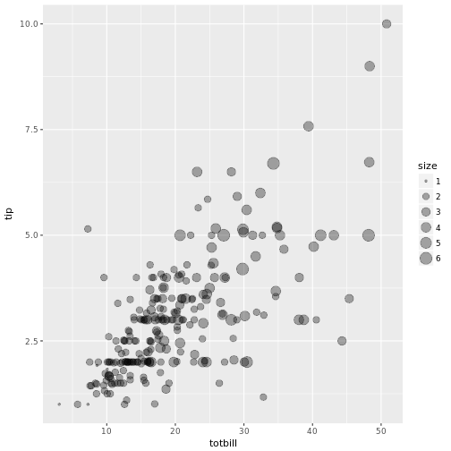
Tamaño
========================================================


```r
ggplot(data = tips, aes(x = totbill, y = tip) ) +
  geom_point(size = 5, alpha = 1 / 3) 
```

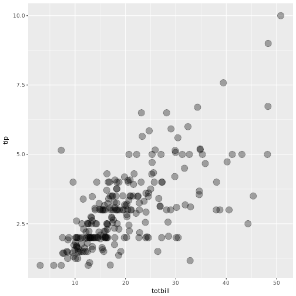

Faceteado
========================================================

- Se pueden desplegar variables categóricas adicionales en un plot usando faceteado.

- Crea tablas de gráficos partiendo los datos en subconjuntos y mostrándolos el mismo gráfico para cada subconjunto.

Dos tipos: i) facet_grid and ii) facet_wrap

Faceteado con facet_wrap
========================================================

```r
ggplot(data = tips, aes(x = totbill, y = tip)) +
  geom_point() +
 facet_wrap( ~sex)
```

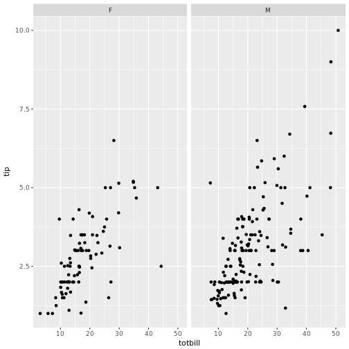

Faceteado con facet_grid
========================================================

```r
ggplot(data = tips, aes(x = totbill, y = tip)) +
  geom_point() +
 facet_grid(sex~ smoker)
```


Sustitutendo geom_point() por otros geoms
========================================================
Cuando substituímos geom_point() por otro geom obtenemos un plot distinto. Los geom más comunes:

geom_smooth()
geom_boxplot()
geom_histogram()
geom_bar()
geom_path() y geom_lines()

Suavizar el scatterplot
========================================================
Si el scatterplot tiene mucho ruido se puede usar un suavizado para facilitar la visualización del patrón dominante usando geom_smooth().

Distintos métodos de suavizado por ejemplo: lm, glm, gam, loess y rlm


```r
ggplot(data = tips, aes(x = totbill, y = tip)) +
  geom_point() + 
  geom_smooth()
```

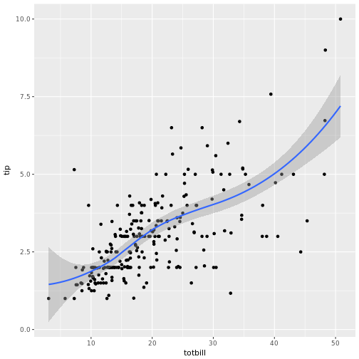
Incluir un suavizado lineal
========================================================

```r
ggplot(data = tips, aes(x = totbill, y = tip)) +
  geom_point() + 
  geom_smooth(method = "lm")
```

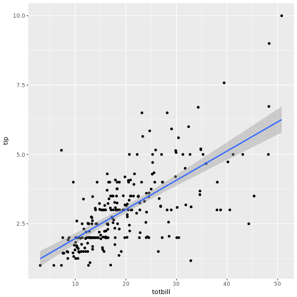
Incluir un suavizado lineal
========================================================

```r
tips.lm <- lm(tip ~ totbill, data = tips)
coef <- tips.lm$coefficients
ggplot(data = tips, aes(x = totbill, y = tip)) +
  geom_point() + 
  geom_abline(intercept = coef[[1]] , slope = coef[[2]] )
```

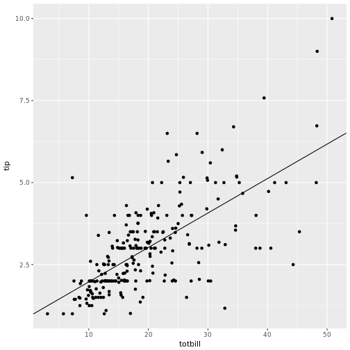

Incluir etiquetas
========================================================

```r
ggplot(data = tips, aes(x = totbill, y = tip, colour = sex)) +
  geom_point() + labs(x = "Total de la cuenta", y = "Propina", 
                      colour = "Sexo")
```


Incluir etiquetas
========================================================

```r
ggplot(data = tips, aes(x = totbill, y = tip, colour = sex)) +
  geom_point() + 
  scale_x_continuous(name ="Total de la cuenta") +
  scale_y_continuous(name = "Propina") +
  scale_color_discrete("Sexo")
```


A PRACTICAR: propuesta 1
========================================================
Con una muestra de 1000 observaciones de la base $diamonds$:

```r
dsamp <- diamonds[sample(nrow(diamonds), 1000), ]
```
- Elaborar scatter plot de $price$ versus $carat$ (peso de los diamantes)
- Incluir usando $labs$(etiquetas) el nombre de los ejes, título informativo y nombre de la leyenda
- Colorear usando la variable $cut$
- Usar transparencias para el sobre ploteado $alpha$


```r
head(diamonds)
```

```
# A tibble: 6 x 10
  carat cut       color clarity depth table price     x     y     z
  <dbl> <ord>     <ord> <ord>   <dbl> <dbl> <int> <dbl> <dbl> <dbl>
1 0.230 Ideal     E     SI2      61.5  55.0   326  3.95  3.98  2.43
2 0.210 Premium   E     SI1      59.8  61.0   326  3.89  3.84  2.31
3 0.230 Good      E     VS1      56.9  65.0   327  4.05  4.07  2.31
4 0.290 Premium   I     VS2      62.4  58.0   334  4.20  4.23  2.63
5 0.310 Good      J     SI2      63.3  58.0   335  4.34  4.35  2.75
6 0.240 Very Good J     VVS2     62.8  57.0   336  3.94  3.96  2.48
```
Propuesta 1: solución
========================================================


```r
dsamp <- diamonds[sample(nrow(diamonds), 1000), ]
```

```r
ggplot(data = dsamp, aes(x = price, y = carat, colour = cut)) +
  geom_point(alpha = 1 / 3) + labs(x = "Precio en dólares", y = "Peso de los diamantes", 
                      colour = "Corte")+ 
    ggtitle("Precio en dólares de los diamantes según peso") 
```


A PRACTICAR: propuesta 2
========================================================
- Utilizando el plot anterior, cambiar la paleta de colores a "Purples"
- Chequear la ayuda de ?scale_colour_brewer

```r
?scale_colour_brewer
```
Propuesta 2: solución
========================================================


```r
ggplot(data = dsamp, aes(x = price, y = carat, colour = cut)) +
  geom_point(alpha = 1 / 3) + labs(x = "Precio en dólares", y = "Peso de los diamantes", 
                      colour = "Corte")+ 
    ggtitle("Precio en dólares de los diamantes según peso") +
    scale_colour_brewer(palette = "Purples")
```

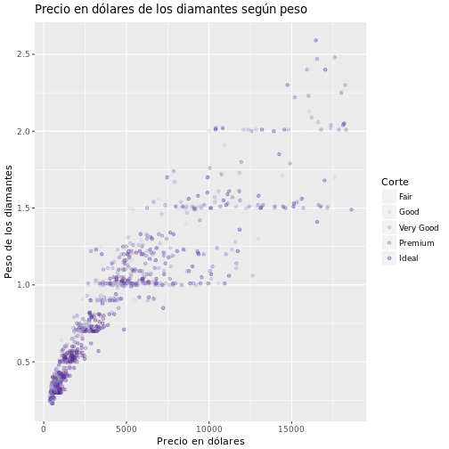
A PRACTICAR: propuesta 3
========================================================
- $scale$ controla el mapeo de los datos a los elementos estéticos
- El argumento $breaks$ controla los valores que aparecen en las l{ineas de división de los ejes y tienen asociado una etiqueta que está controlada por $label$
- Sobre el plot inicial, cambiar las líneas de división en el eje de las y a 1, 2 y 3 con las etiquetas 1 oz, 2 oz y 3 oz
- ?scale_y_continuous

Propuesta 3: solución
========================================================

```r
ggplot(data = dsamp, aes(x = price, y = carat, colour = cut)) +
  geom_point(alpha = 1 / 3) + labs(x = "Precio en dólares", y = "Peso de los diamantes", 
                      colour = "Corte")+ 
    ggtitle("Precio en dólares de los diamantes según peso") +
    scale_colour_brewer(palette = "Purples") + 
  scale_y_continuous(
  breaks = c(1, 2, 3),
  label = c("1 oz", "2 oz", "3 oz")
)
```


A PRACTICAR: propuesta 4
========================================================
Usar la variable $cut$ para crear un gráfico para cada subconjunto (usar transparencias para el sobre ploteado alpha)


```r
?facet_wrap
```
Propuesta 4: solución
========================================================

```r
ggplot(data = dsamp, aes(x = price, y = carat, colour = cut)) +
  geom_point(alpha = 1 / 3) + labs(x = "Precio en dólares", y = "Peso de los diamantes", 
                      colour = "Corte")+ 
    ggtitle("Precio en dólares de los diamantes según peso") +
    scale_colour_brewer(palette = "Purples") + 
 facet_wrap( ~cut)
```

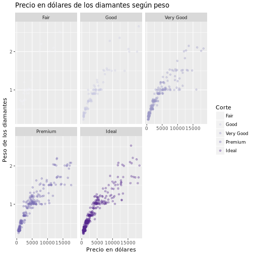

Para conocer más
========================================================
- http://ggplot2.tidyverse.org/
- Libro para salir del paso: "R Graphics Cookbook" http://www.cookbook-r.com/Graphs/
- Libro para ir más a fondo y entender el lenguaje que sustenta a ggplot2: "ggplot2: Elegant Graphics for Data Analysis" https://github.com/hadley/ggplot2-book
- Cheatsheets de RStudio: https://www.rstudio.com/wp-content/uploads/2015/03/ggplot2-cheatsheet.pdf https://github.com/rstudio/cheatsheets/raw/master/data-visualization-2.1.pdf
- http://tutorials.iq.harvard.edu/R/Rgraphics/Rgraphics.html

Por ayuda
========================================================
- Lista de mails: http://groups.google.com/group/ggplot2

- stackoverflow: http://stackoverflow.com

